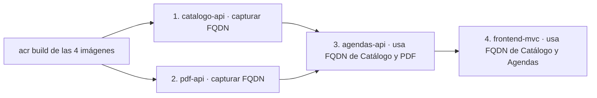

# Prompt — Generación de script de despliegue en Azure Container Apps

> **Uso:** copie y pegue el contenido de las secciones 1 a 9 como un único mensaje a un copiloto de IA (GitHub Copilot Chat, Claude, ChatGPT, etc.) para que genere el script PowerShell de despliegue.
> **Salida esperada del modelo:** un archivo `deploy-azure.ps1` ubicado en `Code/` y ejecutable desde esa misma carpeta.

---

## 1. Rol que debe asumir el modelo

> Actúa como un **Ingeniero DevOps Senior** experto en **Azure CLI, Azure Container Apps, Azure Container Registry y PowerShell 5.1**. Tu única tarea es producir un script `deploy-azure.ps1` listo para ejecutar, sin explicaciones adicionales fuera del propio script. El script se ejecutará desde la carpeta `Code/` de un repositorio .NET multi-proyecto.

---

## 2. Objetivo

Generar un **único script PowerShell** (`Code/deploy-azure.ps1`) que automatice el ciclo completo de despliegue en Azure para la solución **PROCalendarizacionInversores** (PROCOMER · prueba técnica 2026XE-000001-0001700001):

1. Construir las imágenes Docker de **cuatro proyectos** mediante `az acr build` (build remoto, sin Docker local).
2. Publicar cada imagen en el **Azure Container Registry** ya provisionado.
3. Crear o actualizar (idempotente) un **Azure Container App** por cada proyecto en el **Container Apps Environment** ya provisionado.
4. Inyectar **todas las claves de configuración** de cada `appsettings.json` como **variables de ambiente** del Container App correspondiente, usando la notación `Section__SubSection__Key` exigida por .NET.
5. Resolver dinámicamente los FQDN de los microservicios y propagarlos como variables de ambiente a los consumidores (frontend y agendas) para que la comunicación entre Container Apps funcione sin URLs hardcodeadas.
6. Imprimir al final un resumen con las URLs públicas de cada servicio.

---

## 3. Infraestructura Azure ya provisionada (NO crear, solo usar)

| Recurso | Nombre |
|---|---|
| Suscripción | la que esté activa en `az account show` |
| Resource Group | `rsgr-E02-TST-EaUS` |
| Region / Location | `eastus` *(la del environment `eaus`)* |
| Azure Container Registry | `acre02prd` *(FQDN: `acre02prd.azurecr.io`)* |
| Container Apps Environment | `rs-cae-e02-tst-4e4d-eaus-1` |
| Azure SQL Server (logical) | `rs-dbs-pte02-tst-4e4d-eaus-1.database.windows.net` |
| Base de datos | `PROInversores` |

**Restricción crítica:** el script **NO** debe ejecutar `az group create`, `az acr create` ni `az containerapp env create`. Debe asumir que ya existen y limitarse a usarlos. Sí debe **verificar** su existencia con `az ... show` y abortar con `Write-Error` si alguno no se encuentra.

**Acceso al ACR:** habilitar autenticación de administrador (`az acr update --admin-enabled true`) y capturar `username` / `password` con `az acr credential show` para usarlos como `--registry-server`, `--registry-username` y `--registry-password` en cada `az containerapp create`.

---

## 4. Estructura de la solución `PROCalendarizacionInversores.sln`

La solución sigue **Clean Architecture por microservicio** (Domain / Application / Infrastructure / API) más un frontend MVC. Sólo los proyectos `*.API` y `Frontend.MVC` son **deployables** (tienen `Program.cs` y deben empaquetarse en imagen Docker).

```
Code/
├── PROCalendarizacionInversores.sln
├── Catalogo/
│   ├── Catalogo.Domain/         (no deployable)
│   ├── Catalogo.Application/    (no deployable)
│   ├── Catalogo.Infrastructure/ (no deployable)
│   └── Catalogo.API/            ← deployable · microservicio Catálogo
│       ├── Catalogo.API.csproj
│       └── appsettings.json
├── Agendas/
│   ├── Agendas.Domain/          (no deployable)
│   ├── Agendas.Application/     (no deployable)
│   ├── Agendas.Infrastructure/  (no deployable)
│   └── Agendas.API/             ← deployable · microservicio Agendas (orquestador)
│       ├── Agendas.API.csproj
│       └── appsettings.json
├── PDF/
│   ├── PDF.Domain/              (no deployable)
│   ├── PDF.Application/         (no deployable)
│   ├── PDF.Infrastructure/      (no deployable)
│   └── PDF.API/                 ← deployable · microservicio PDF
│       ├── PDF.API.csproj
│       └── appsettings.json
├── Frontend/
│   └── Frontend.MVC/            ← deployable · ASP.NET MVC
│       ├── Frontend.MVC.csproj
│       └── appsettings.json
└── tests/
    └── Agendas.UnitTests/       (no deployable)
```

**Asunciones para el `Dockerfile`:** cada proyecto deployable contiene su `Dockerfile` junto a su `.csproj` y está preparado para `dotnet publish` multi-stage. Si el modelo necesita rutas concretas, debe usar:

| Container App | `--image` | `--file` (Dockerfile) | Contexto |
|---|---|---|---|
| `catalogo-api` | `catalogo-api:latest` | `Catalogo/Catalogo.API/Dockerfile` | `.` (carpeta `Code/`) |
| `agendas-api` | `agendas-api:latest` | `Agendas/Agendas.API/Dockerfile` | `.` |
| `pdf-api` | `pdf-api:latest` | `PDF/PDF.API/Dockerfile` | `.` |
| `frontend-mvc` | `frontend-mvc:latest` | `Frontend/Frontend.MVC/Dockerfile` | `.` |

**Puerto del contenedor:** todos los `.csproj` ASP.NET escuchan en `8080` (`--target-port 8080`).

---

## 5. Configuración a inyectar como variables de ambiente

Cada Container App debe recibir, como `--env-vars`, **todas** las claves de su `appsettings.json` convertidas a la sintaxis de variables jerárquicas de .NET (`__` en lugar de `:`).

### 5.1 Cadena de conexión compartida (literal, hardcodeada en el script)

```text
Server=rs-dbs-pte02-tst-4e4d-eaus-1.database.windows.net;Database=PROInversores;User Id=usr_e02_tst;Password=Mj47Rw2025!;Encrypt=True;TrustServerCertificate=False;
```

> Definir en una variable PowerShell `$DB_CONNECTION` al inicio del script y reutilizarla. **Incluir un comentario destacado** advirtiendo que en producción real se debe usar Azure Key Vault + `secretref:` (igual que el script de referencia).

### 5.2 `Catalogo.API` — variables de ambiente

| Variable | Valor |
|---|---|
| `ASPNETCORE_ENVIRONMENT` | `Production` |
| `ConnectionStrings__DefaultConnection` | `$DB_CONNECTION` |
| `AllowedHosts` | `*` |
| `Logging__LogLevel__Default` | `Information` |
| `Logging__LogLevel__Microsoft.AspNetCore` | `Warning` |

### 5.3 `Agendas.API` — variables de ambiente

| Variable | Valor |
|---|---|
| `ASPNETCORE_ENVIRONMENT` | `Production` |
| `ConnectionStrings__DefaultConnection` | `$DB_CONNECTION` |
| `ServiceUrls__CatalogoService` | `https://$CATALOGO_FQDN` *(resuelto dinámicamente)* |
| `ServiceUrls__PdfService` | `https://$PDF_FQDN` *(resuelto dinámicamente)* |
| `AllowedHosts` | `*` |
| `Logging__LogLevel__Default` | `Information` |
| `Logging__LogLevel__Microsoft.AspNetCore` | `Warning` |

### 5.4 `PDF.API` — variables de ambiente

| Variable | Valor |
|---|---|
| `ASPNETCORE_ENVIRONMENT` | `Production` |
| `AllowedHosts` | `*` |
| `Logging__LogLevel__Default` | `Information` |
| `Logging__LogLevel__Microsoft.AspNetCore` | `Warning` |

> `PDF.API` no requiere acceso a SQL.

### 5.5 `Frontend.MVC` — variables de ambiente

| Variable | Valor |
|---|---|
| `ASPNETCORE_ENVIRONMENT` | `Production` |
| `ServiceUrls__CatalogoService` | `https://$CATALOGO_FQDN` |
| `ServiceUrls__AgendasService` | `https://$AGENDAS_FQDN` |
| `AllowedHosts` | `*` |
| `Logging__LogLevel__Default` | `Information` |
| `Logging__LogLevel__Microsoft.AspNetCore` | `Warning` |

---

## 6. Estrategia de ingress

Conforme al requerimiento "el frontend consume directamente cada microservicio a través de su URL pública en Azure Container Apps":

| Container App | Ingress | Target port |
|---|---|---|
| `catalogo-api` | `external` | `8080` |
| `agendas-api` | `external` | `8080` |
| `pdf-api` | `external` | `8080` |
| `frontend-mvc` | `external` | `8080` |

> Aunque todos sean externos, el script debe seguir resolviendo y propagando los FQDN dinámicamente — no usar URLs estáticas en el código del script.

---

## 7. Orden de despliegue (importante por dependencias)



Después de cada `az containerapp create/update` capturar el FQDN con:

```powershell
az containerapp show --name <app> --resource-group $RESOURCE_GROUP --query "properties.configuration.ingress.fqdn" -o tsv
```

y guardarlo en una variable (`$CATALOGO_FQDN`, `$PDF_FQDN`, `$AGENDAS_FQDN`, `$FRONTEND_FQDN`).

---

## 8. Estructura del script (modelo a seguir)

El script de salida debe replicar la estructura, estilo y convenciones del script de referencia ubicado en:

```
C:\Procomer\CryptoMonedas-Marvin\Documentos\deploy-azure.ps1
```

Específicamente debe contener, **en este orden**, secciones comentadas con cabeceras tipo `# === Sección N: ... ===`:

1. **Cabecera** con título, descripción y advertencia de seguridad por la contraseña en claro.
2. `Set-StrictMode -Version Latest` y `$ErrorActionPreference = "Stop"`.
3. **Sección 1 — Variables de infraestructura** (`$RESOURCE_GROUP`, `$LOCATION`, `$ACR_NAME`, `$CAE_NAME`, `$BUILD_CONTEXT = "."`, `$DB_CONNECTION`).
4. **Sección 2 — Verificación de Resource Group** (sólo `show`, abortar si no existe).
5. **Sección 3 — Verificación de ACR + admin-enabled + captura de credenciales**.
6. **Sección 4 — `az acr build` de las cuatro imágenes** con `Write-Host` numerado `[1/4] ... [4/4]`.
7. **Sección 5 — Verificación del Container Apps Environment** (sólo `show`).
8. **Sección 6 — Despliegue de `catalogo-api`** (create-or-update idempotente) + captura `$CATALOGO_FQDN`.
9. **Sección 7 — Despliegue de `pdf-api`** + captura `$PDF_FQDN`.
10. **Sección 8 — Despliegue de `agendas-api`** (inyecta `$CATALOGO_FQDN` y `$PDF_FQDN`) + captura `$AGENDAS_FQDN`. En la rama de actualización usar `--set-env-vars` para refrescar las URLs.
11. **Sección 9 — Despliegue de `frontend-mvc`** (inyecta `$CATALOGO_FQDN` y `$AGENDAS_FQDN`) + captura `$FRONTEND_FQDN`. En la rama de actualización usar `--set-env-vars` para refrescar las URLs.
12. **Sección 10 — Resumen final** con un bloque visible (líneas `=====`) que liste las 4 URLs públicas:

    ```
    Catalogo API  : https://$CATALOGO_FQDN
    Agendas API   : https://$AGENDAS_FQDN
    PDF API       : https://$PDF_FQDN
    Frontend MVC  : https://$FRONTEND_FQDN
    ```

**Convenciones de estilo a respetar (idénticas a la referencia):**

- Mensajes de progreso con `Write-Host` y colores (`Cyan` para títulos, `Yellow` para acciones, `Green` para éxito, `DarkGray` para informativos).
- Continuación de línea con backtick `` ` `` en cada parámetro de `az`.
- Comentarios de cabecera con líneas `# ===========================================...`.
- Patrón **idempotente** en cada Container App: `az containerapp show ... 2>&1 | Out-Null` + comprobación de `$LASTEXITCODE` para decidir entre `create` y `update`.

---

## 9. Criterios de aceptación

El script generado se considera correcto si y sólo si:

1. Es **un único archivo** `.ps1` válido para PowerShell 5.1.
2. Define **exactamente cuatro** Container Apps con los nombres `catalogo-api`, `agendas-api`, `pdf-api`, `frontend-mvc`.
3. Reutiliza la variable `$DB_CONNECTION` en `catalogo-api` y `agendas-api`, sin repetir el literal de la contraseña.
4. **No** intenta crear el Resource Group, el ACR ni el Container Apps Environment.
5. Resuelve los FQDN dinámicamente con `az containerapp show ... --query "properties.configuration.ingress.fqdn"` después de cada creación/actualización.
6. Mapea **todas** las claves de los `appsettings.json` documentados en la sección 5 a variables `Section__Key` (doble guion bajo).
7. Es idempotente: si se ejecuta dos veces seguidas, la segunda corrida actualiza imágenes y variables sin error.
8. Imprime al final las cuatro URLs públicas.

---

## 10. Instrucción final para el modelo

> Genera ahora el contenido completo de `Code/deploy-azure.ps1` cumpliendo todos los requisitos anteriores. **No incluyas explicaciones**, sólo el código del script dentro de un único bloque ```` ```powershell ... ``` ````. Si detectas alguna ambigüedad o información faltante, asume el valor más conservador y deja un comentario `# TODO:` en la línea correspondiente del script.
