# Documentación del Prototipo — Calendarización de Inversores

**Proyecto:** PROCOMER · Sistema de Calendarización de Inversores
**Contratación:** 2026XE-000001-0001700001
**Artefacto:** Prototipo navegable de alta fidelidad (HTML/Bootstrap 5)
**Archivo fuente:** [Docs/Prototipo/Inversores-prototipo.html](Inversores-prototipo.html)
**Fecha:** Junio 2026 · Gate 1

---

## 1. Propósito del prototipo

El prototipo es una maqueta funcional, navegable en el navegador, que materializa de extremo a extremo el flujo de coordinación de visitas de inversores extranjeros descrito en la prueba técnica. Su finalidad es triple:

1. **Validar la interpretación del requerimiento** con el equipo de negocio antes de iniciar la construcción, mostrando cada pantalla, su contenido, sus validaciones y sus estados de error.
2. **Servir como contrato visual** para los desarrolladores que implementarán el frontend ASP.NET MVC y los tres microservicios backend (Catálogo, Agendas, PDF).
3. **Demostrar las reglas de negocio críticas** (RN-01 a RN-15) en una interfaz interactiva, incluyendo casos felices y casos de error (idioma incompatible, fecha fuera de ventana, eliminación bloqueada, anulación lógica, etc.).

El prototipo se construye con **Bootstrap 5.3.3 + Bootstrap Icons** sobre una paleta institucional verde (`#0c7c59`), respetando los criterios de accesibilidad WCAG AA (área táctil mínima 44 px, contraste, `prefers-reduced-motion`, mensajes de error explícitos).

---

## 2. Arquitectura de navegación

El prototipo se organiza como una **SPA simulada** con una barra de navegación superior fija y cinco secciones (`.page`) que se intercambian mediante la función `go(page)`. Todas las acciones quedan acompañadas de un sistema unificado de **toasts** y **modales** Bootstrap para feedback al usuario.

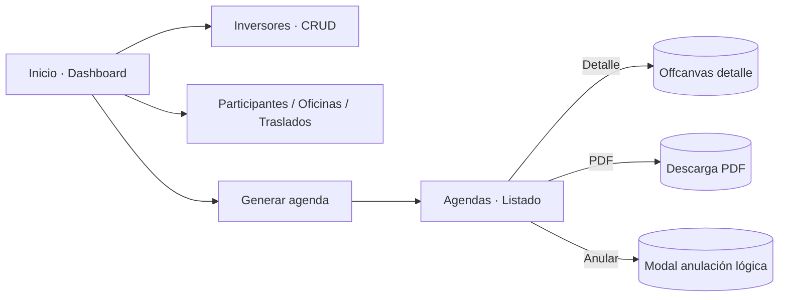

| # | Sección | Ruta lógica | Caso de uso |
|---|---------|-------------|-------------|
| 1 | Inicio | `#inicio` | Dashboard de coordinación |
| 2 | Inversores | `#inversores` | CU-01 Mantenimiento de inversores |
| 3 | Participantes / Oficinas / Traslados | `#participantes` | CU-02 / CU-03 / CU-07 |
| 4 | Generar agenda | `#agenda` | CU-04 Generación automática |
| 5 | Agendas | `#agendas` | CU-05 Consulta y CU-06 PDF / Anulación |

---

## 3. Recorrido por pantallas

A continuación se describen, en el orden de las imágenes numeradas, cada una de las pantallas que componen el prototipo.

### 3.1 Inicio · Dashboard de coordinación — `01-Agendas.png`

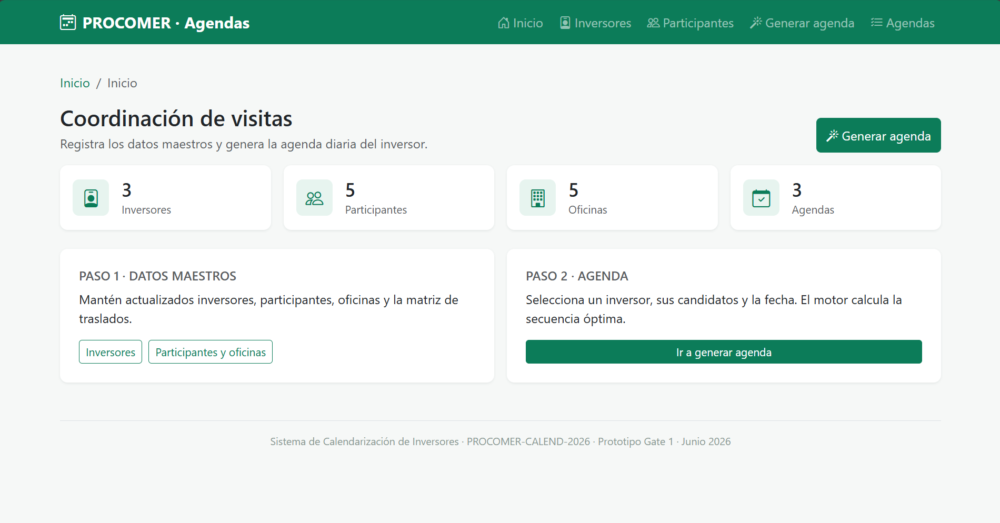

**Objetivo.** Servir como **pantalla de entrada** del sistema. Resume el estado del catálogo y orienta al coordinador hacia los dos grandes pasos del proceso: mantener los datos maestros y generar la agenda diaria del inversor.

**Componentes clave:**

- **Encabezado de página** con el título *Coordinación de visitas* y el subtítulo *"Registra los datos maestros y genera la agenda diaria del inversor."*, acompañado del botón primario *Generar agenda* (atajo directo al CU-04).
- **Tarjetas de KPI** (`stat-card`) con conteos rápidos del sistema:
  - Inversores registrados.
  - Participantes activos.
  - Oficinas dadas de alta.
  - Agendas generadas.
  Cada tarjeta usa un ícono de Bootstrap Icons sobre un fondo verde suave (`--brand-soft`) para mantener la jerarquía visual sin distraer del contenido numérico.
- **Bloque guía de dos columnas**:
  - *Paso 1 · Datos maestros* — accesos a Inversores y a Participantes/Oficinas.
  - *Paso 2 · Agenda* — acceso al generador automático.
  Esta organización refuerza al usuario que el flujo correcto es **primero catálogos, luego agenda**, evitando intentos de generación con datos incompletos.
- **Breadcrumb** *Inicio* fijo en la parte superior para mantener la orientación cuando el usuario navega a otras secciones.

> **Casos de uso enlazados:** acceso directo a CU-01 (Inversores), CU-02/CU-03 (Participantes/Oficinas) y CU-04 (Generar agenda).

---

### 3.2 Listado de inversores — `02-Inversores.png`

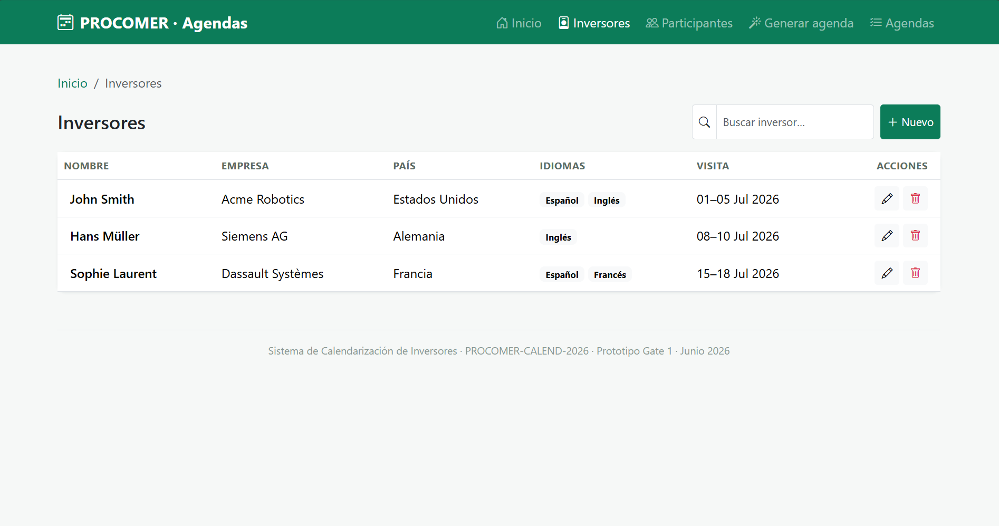

**Objetivo.** Mantener el catálogo de inversores que serán visitados.

**Componentes:**

- **Búsqueda incremental** (`filterTable`) sobre la tabla, sin recargar la página.
- **Tabla** con columnas: `Nombre`, `Empresa`, `País`, `Idiomas`, `Visita`, `Acciones`.
- Los idiomas se renderizan como **chips Bootstrap** (`.lang-chip`) para identificarlos visualmente; es la información crítica para el algoritmo de scheduling (RN-12).
- La ventana de visita se muestra en formato corto `01–05 Jul 2026` para que el coordinador valide los rangos de un vistazo.
- **Acciones por fila**: editar (abre el modal del inversor en modo edición) y eliminar (abre confirmación con bloqueo por agendas activas — RN-03).
- **Estado vacío** controlado por `#emptyInversores` cuando ningún registro coincide con la búsqueda.

> **Reglas demostradas:** RN-01 (al menos un idioma), RN-02 (fechas coherentes), RN-03 (no eliminar inversor con agendas activas).

---

### 3.3 Modal "Nuevo / editar inversor" — `03-CrearInversor.png`

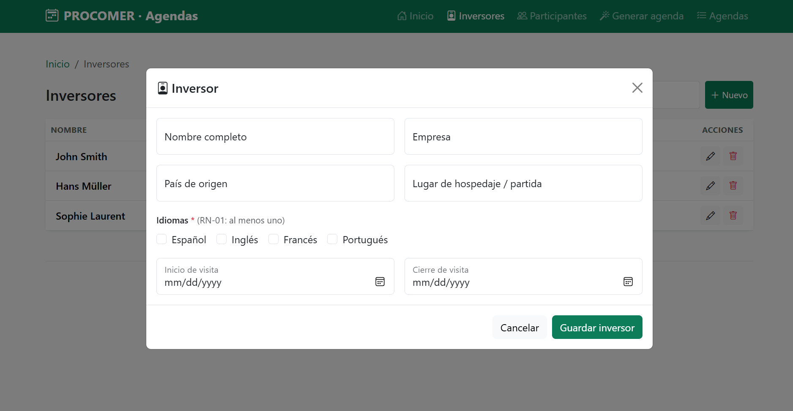

**Objetivo.** Capturar y validar los datos de un inversor.

**Campos:**

| Campo | Tipo | Validación |
|-------|------|------------|
| Nombre completo | texto | Requerido |
| Empresa | texto | Requerido |
| País de origen | texto | Requerido |
| Lugar de hospedaje / partida | texto | Opcional (punto de salida diario) |
| Idiomas | checkbox múltiple (Español, Inglés, Francés, Portugués) | **RN-01** — al menos uno marcado; si no, se muestra `#idiomaErr` |
| Inicio de visita | date | Requerido |
| Cierre de visita | date | **RN-02** — no anterior al inicio; `setCustomValidity` controla el `invalid-feedback` |

**Comportamiento:**

- La función `validarFechas()` valida en cliente la coherencia inicio/fin en cada `change`.
- El submit dispara `guardarInversor()`, que aplica `was-validated` de Bootstrap y bloquea el envío si falta algún campo o no hay idioma.
- Al guardar correctamente se cierra el modal y se muestra el toast verde "Inversor guardado correctamente."

> **Reglas demostradas:** RN-01, RN-02. El modal sirve tanto para alta como para edición (reutilización del componente).

---

### 3.4 Pestaña "Participantes" — `04-Participantes.png`

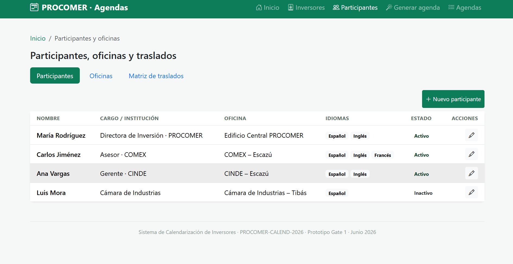

**Objetivo.** Mantener el catálogo de funcionarios, aliados y representantes institucionales que se pueden reunir con los inversores.

**Componentes:**

- La sección "Participantes, oficinas y traslados" se organiza con **`nav-pills`** que conmuta entre tres pestañas: *Participantes*, *Oficinas* y *Matriz de traslados*. Esto resuelve en una sola pantalla las tres entidades del módulo 4.2 de la prueba.
- **Tabla** con columnas: `Nombre`, `Cargo / Institución`, `Oficina`, `Idiomas`, `Estado`, `Acciones`.
- **Estado** del participante (Activo / Inactivo) representado con badges semánticos. Los inactivos se excluyen del scheduling sin perder histórico.
- Cada fila muestra los idiomas como chips, igual que en inversores, para facilitar la verificación visual del match de idioma exigido por el algoritmo.

> **Reglas demostradas:** RN-04 (al menos un idioma), RN-05 (oficina obligatoria), estado lógico para preservar histórico.

---

### 3.5 Modal "Nuevo participante" — `05-NuevoParticipante.png`

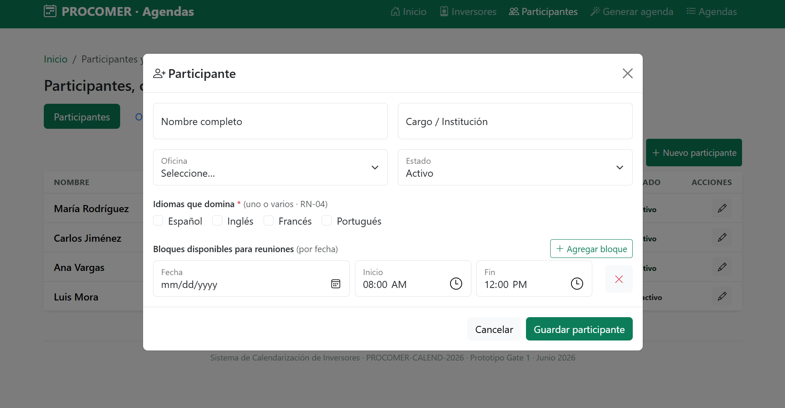

**Objetivo.** Capturar los datos del participante y, lo más importante, su **disponibilidad horaria por fecha**, insumo crítico del algoritmo de scheduling.

**Campos:**

| Campo | Tipo | Validación |
|-------|------|------------|
| Nombre completo | texto | Requerido |
| Cargo / Institución | texto | Requerido |
| Oficina | select del catálogo de oficinas | **RN-05** requerido |
| Estado | select (Activo / Inactivo) | Por defecto Activo |
| Idiomas que domina | checkbox múltiple | **RN-04** — al menos uno |
| Bloques disponibles para reuniones | lista dinámica de `{fecha, inicio, fin}` | Botón "Agregar bloque" / "Quitar bloque"; estado vacío explícito |

**Comportamiento dinámico:**

- `agregarBloque()` inserta una fila con tres inputs (`date`, `time`, `time`).
- `eliminarBloque()` retira la fila y, si no queda ninguna, muestra el estado vacío `#bloquesEmpty` advirtiendo que el participante no será candidato en el scheduling.
- `guardarParticipante()` valida idiomas y campos requeridos, y al guardar muestra un toast con el conteo de idiomas y bloques registrados (ayuda visual de feedback).

> **Reglas demostradas:** RN-04, RN-05. El diseño hace explícito que **sin bloques no hay candidatura**, lo que evita generaciones de agenda inviables.

---

### 3.6 Pestaña "Oficinas" — `06-Oficinas.png`

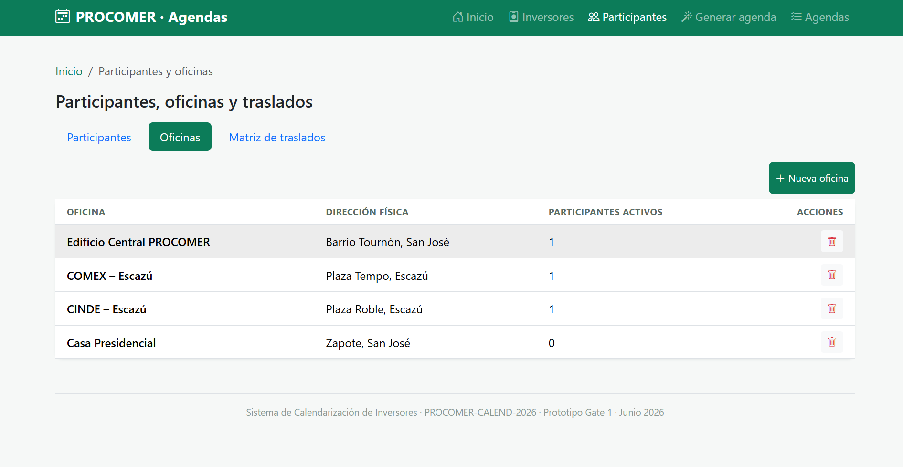

**Objetivo.** Administrar las ubicaciones físicas donde se realizan las reuniones.

**Componentes:**

- **Tabla** con: `Oficina`, `Dirección física`, `Participantes activos`, `Acciones`.
- La columna `Participantes activos` es informativa y, sobre todo, condiciona la **acción de eliminar** (RN-06): si hay participantes activos asignados, el botón "Eliminar" abre el modal de confirmación pero con la alerta de bloqueo "No es posible eliminar: tiene registros activos asociados" y el botón de confirmar deshabilitado.
- El botón "Nueva oficina" abre el modal correspondiente (sección 3.7).

> **Reglas demostradas:** RN-06 (no eliminar oficina con participantes activos).

---

### 3.7 Modal "Nueva oficina" — `07-NuevaOficina.png`

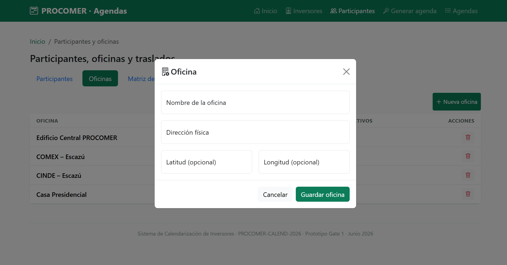

**Campos:**

| Campo | Tipo | Validación |
|-------|------|------------|
| Nombre de la oficina | texto | Requerido |
| Dirección física | texto | Requerido |
| Latitud | texto | Opcional |
| Longitud | texto | Opcional |

Las coordenadas son opcionales porque no son insumo del algoritmo (que se basa en la matriz de tiempos), pero quedan disponibles para una eventual integración con mapas o cálculo dinámico de rutas.

---

### 3.8 Matriz de traslados — `08-Traslados.png`

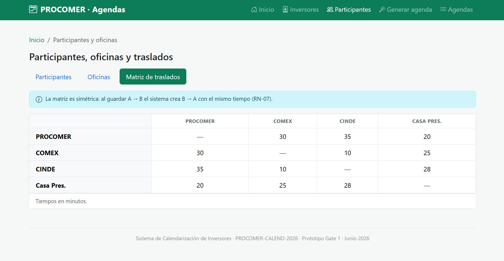

**Objetivo.** Mantener la matriz de tiempos de desplazamiento entre cada par de oficinas, insumo directo del algoritmo de scheduling para validar la holgura entre reuniones consecutivas.

**Diseño:**

- Tabla cuadrada con las oficinas como filas y columnas; la diagonal queda en blanco (`—`).
- **Alerta superior** que comunica al usuario la regla **RN-07** (matriz simétrica): el sistema persiste automáticamente `B → A` con el mismo tiempo al guardar `A → B`.
- Pie de tabla aclarando que los tiempos están en **minutos**.

> **Reglas demostradas:** RN-07 (simetría de la matriz). El editor inline (no mostrado en imagen) permite actualizar celdas individuales.

---

### 3.9 Generar agenda — `09-GenerarAgenda.png`

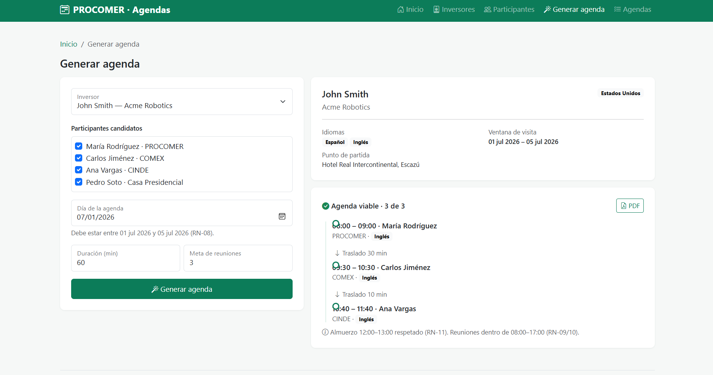

**Objetivo.** Pantalla principal del sistema, donde el coordinador solicita la generación automática y visualiza el resultado.

La pantalla se divide en dos columnas (responsive con `col-lg-5` + `col-lg-7`):

#### Columna izquierda — Formulario de solicitud

| Campo | Tipo | Detalle |
|-------|------|---------|
| Inversor | select | Al cambiar dispara `onSelectInversor()` que carga los datos del panel derecho y configura los `min/max` del input de fecha (**RN-08**) |
| Participantes candidatos | checkbox múltiple | Lista de participantes activos; el coordinador puede recortar el conjunto |
| Día de la agenda | date | Deshabilitado hasta seleccionar inversor; queda acotado a la ventana de visita |
| Duración (min) | number | Default 60, paso 15, mínimo 15 |
| Meta de reuniones | number | Default 3, mínimo 1 |
| Botón "Generar agenda" | submit | Cambia a estado *loading* con spinner mientras el motor calcula |

#### Columna derecha — Panel dinámico

- **Panel del inversor** (`#panelInversor`): al seleccionar inversor se muestran nombre, empresa, país (badge), idiomas (chips), ventana de visita y punto de partida (hotel). Es la "ficha viva" exigida por el requerimiento (validar datos antes de generar).
- **Área de resultado** (`#resultadoArea`) con tres posibles estados:
  1. **Skeleton de carga** mientras el endpoint `POST /agendas/generar` responde.
  2. **Resultado exitoso** — Tarjeta verde con timeline de reuniones (hora, participante, oficina, idioma) intercaladas con los **tiempos de traslado**, más un recordatorio del bloqueo de almuerzo 12:00–13:00 (RN-11) y la ventana 08:00–17:00 (RN-09 / RN-10).
  3. **Resultado de error** — Alerta amarilla cuando ningún participante comparte idioma con el inversor: muestra el código `HTTP 422 · IDIOMA_INCOMPATIBLE · RN-12` (caso demostrado con el inversor *Hans Müller*, que sólo habla inglés).

> **Reglas demostradas:** RN-08, RN-09, RN-10, RN-11, RN-12, RN-13 (traslado entre reuniones), RN-14 (sin solape de participantes).

---

### 3.10 Listado de agendas — `10-Agendas.png`

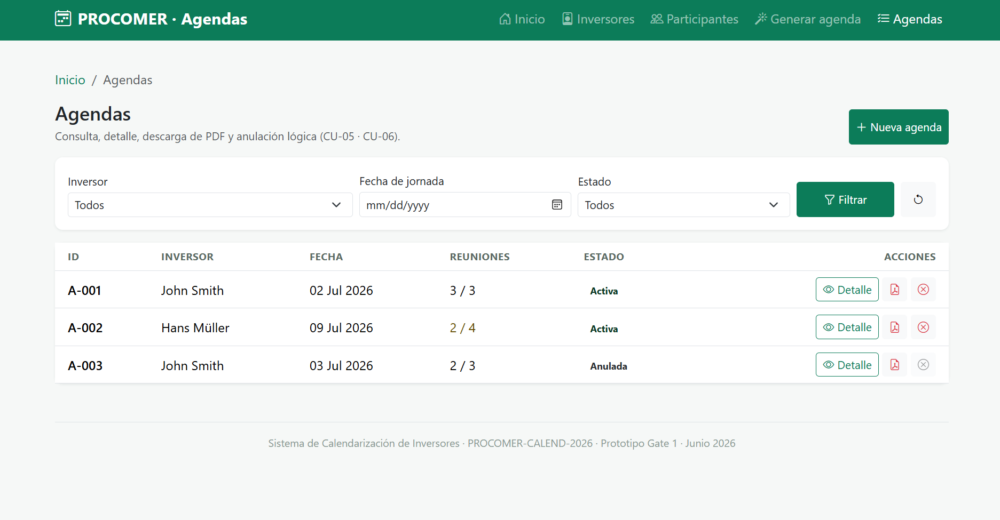

**Objetivo.** Permitir al coordinador consultar todas las agendas generadas y operarlas (ver detalle, descargar PDF, anular).

**Componentes clave:**

- **Barra de filtros combinables** (`#fInversor`, `#fFecha`, `#fEstado`) que implementa el contrato del endpoint `GET /agendas?inversor=&fecha=&estado=`. Los tres filtros se aplican simultáneamente y se acompañan de un botón de "Limpiar".
- **Tabla principal** con columnas: `ID`, `Inversor`, `Fecha`, `Reuniones (logradas/meta)`, `Estado`, `Acciones`.
- **Estados visuales del listado**:
  - *Cargando*: tres skeletons grises animados (`#agendasLoading`).
  - *Error de servicio*: `empty-state` con ícono `wifi-off` y texto "HTTP 503" + botón "Reintentar".
  - *Vacío*: `empty-state` con `calendar-x` cuando no hay coincidencias con los filtros.
- **Indicador de calidad** de la agenda: cuando el resultado es parcial (p. ej. `2 / 4`) se resalta en color ámbar para alertar al coordinador.
- **Estados de cada fila**:
  - `Activa` → badge verde + acciones `Detalle`, `PDF`, `Anular` habilitadas.
  - `Anulada` → badge gris + botón `Anular` deshabilitado con tooltip "HTTP 409"; el PDF sigue disponible por RN-15 (trazabilidad).

> **Reglas demostradas:** RN-15 (eliminación lógica), AC-08 (filtros combinables), manejo defensivo de HTTP 503/409.

---

## 4. Componentes transversales

### 4.1 Modal de eliminación con bloqueo de negocio

Reutilizado por inversores y oficinas. Cuando la entidad tiene dependencias activas, la alerta roja `Lock` se muestra y el botón "Eliminar" se deshabilita: refleja en UI las reglas RN-03 (inversor con agendas) y RN-06 (oficina con participantes).

### 4.2 Modal de anulación de agenda

Refuerza al usuario que la anulación es **lógica** (`soft delete`, RN-15): el estado cambia a *Anulada*, se registra fecha/hora y **el PDF sigue disponible** para trazabilidad. En la lista, las agendas anuladas no permiten anular nuevamente (HTTP 409).

### 4.3 Offcanvas de detalle de agenda

Panel lateral derecho de 480 px que muestra el detalle completo de la agenda (inversor, empresa, fecha, meta lograda, timeline con cada reunión y traslado, idioma en que se efectúa cada reunión). Incluye accesos directos a descargar PDF y anular. Si la agenda está anulada, exhibe la fecha de anulación.

### 4.4 Descarga de PDF

Función `descargarPdf(id)` que simula la llamada a `GET /agendas/{id}/pdf`:

- Construye el nombre `Agenda_<fecha>_<inversor>.pdf` en español de Costa Rica (es-CR).
- Maneja escenarios de **fallo del microservicio** (HTTP 504 tras 3 reintentos), mostrando un toast de error en lugar de descargar.

### 4.5 Sistema de toasts

Función `showToast(msg, type)` con tres variantes (`success`, `error`, `info`) e íconos. Centraliza el feedback al usuario en lugar de usar `alert()`, manteniendo coherencia visual con Bootstrap.

### 4.6 Accesibilidad

- Botones e inputs táctiles con clase `.min-touch` (≥ 44 × 44 px).
- Mensajes de error textuales (`invalid-feedback`) además del color.
- `prefers-reduced-motion` desactiva animaciones de transición y skeletons.
- Etiquetas explícitas con `<label>` y `aria-current` en breadcrumbs.

---

## 5. Trazabilidad prototipo ↔ requerimiento

### 5.1 Reglas de negocio cubiertas

| Regla | Descripción | Pantalla donde se demuestra |
|-------|-------------|------------------------------|
| RN-01 | Inversor con al menos un idioma | Modal Inversor (3.3) |
| RN-02 | Fecha de cierre ≥ inicio | Modal Inversor (3.3) |
| RN-03 | No eliminar inversor con agendas activas | Listado Inversores + Modal eliminar (3.2 / 4.1) |
| RN-04 | Participante con al menos un idioma | Modal Participante (3.5) |
| RN-05 | Participante con oficina obligatoria | Modal Participante (3.5) |
| RN-06 | No eliminar oficina con participantes activos | Listado Oficinas + Modal eliminar (3.6 / 4.1) |
| RN-07 | Matriz de traslados simétrica | Pestaña Traslados (3.8) |
| RN-08 | Agenda dentro de ventana del inversor | Formulario Generar agenda (3.9) |
| RN-09 / RN-10 | Reuniones 08:00–17:00 | Resultado Generar agenda (3.9) |
| RN-11 | Almuerzo 12:00–13:00 bloqueado | Resultado Generar agenda (3.9) |
| RN-12 | Idioma compartido inversor ↔ participante | Resultado de error (3.9) |
| RN-13 | Tiempo de traslado entre reuniones | Timeline del resultado (3.9) |
| RN-14 | Sin solape de un participante | (validado por algoritmo, reflejado en agenda) |
| RN-15 | Anulación lógica con trazabilidad | Modal anular + Listado (4.2 / 3.10) |

### 5.2 Endpoints REST representados en la UI

| Endpoint | Acción del prototipo |
|----------|----------------------|
| `POST /agendas/generar` | Botón "Generar agenda" (3.9) — incluye loading / éxito / error |
| `GET /agendas` | Listado con filtros combinables (3.10) |
| `GET /agendas/{id}` | Offcanvas de detalle (4.3) |
| `DELETE /agendas/{id}` | Modal de anulación lógica (4.2) |
| `GET /agendas/{id}/pdf` | Botones de descarga en listado, detalle y resultado (4.4) |
| CRUD catálogos | Modales de inversor, participante, oficina y editor de matriz |

---

## 6. Decisiones de diseño relevantes

1. **Una sola pantalla para Participantes / Oficinas / Traslados.** Las tres entidades del módulo 4.2 son fuertemente dependientes; agruparlas en pestañas evita saltos de contexto al coordinador.
2. **Panel "ficha viva" del inversor al generar agenda.** Cumple literalmente el requerimiento de "mostrar automáticamente sus datos relevantes al seleccionarlo" y permite detectar datos desactualizados antes de invocar el motor.
3. **Estados de carga y error explícitos.** Cada llamada simulada (listar agendas, generar, descargar PDF) representa los estados *loading / success / error*, anticipando los códigos HTTP que devolverán los microservicios (422, 503, 504, 409). Esto reduce ambigüedad para los desarrolladores al implementar el cliente HttpClient + Polly.
4. **Bootstrap puro sin frameworks JS.** El prototipo es estático y portable (un único `.html`), facilitando su revisión por parte de stakeholders no técnicos.
5. **Paleta y branding institucional.** Verde PROCOMER `#0c7c59` con tonalidades suaves para badges, manteniendo legibilidad y consistencia con la identidad visual.
6. **Mock data realista.** Se incluyen tres inversores con perfiles distintos (uno multilingüe, uno solo inglés, una francófona) para forzar la demostración tanto del flujo exitoso como del error de idioma incompatible.

---

## 7. Limitaciones del prototipo

- Toda la lógica vive en cliente con datos hardcodeados; no hay persistencia ni backend real.
- El algoritmo de scheduling se simula con un `setTimeout` y un dataset fijo; la implementación real será del microservicio de Agendas.
- La generación de PDF es una notificación visual; el microservicio de PDF (es-CR) se entregará en la fase de construcción.
- Las pestañas de matriz de traslados muestran datos de ejemplo no editables; en la implementación final se habilitará edición inline con persistencia.

---

## 8. Próximos pasos

1. Construir el frontend **ASP.NET MVC + jQuery/AJAX** replicando exactamente las vistas y validaciones cliente del prototipo.
2. Implementar los tres microservicios (**Catálogo, Agendas, PDF**) bajo Clean Architecture, en .NET, desplegados como **Azure Container Apps**.
3. Persistir datos en **Azure SQL Database** (script base `01_CreateDatabase.sql`).
4. Cubrir con pruebas unitarias del motor de scheduling los escenarios positivos y negativos exigidos (mínimo 5).
5. Documentar la API con **Swagger / OpenAPI** y entregar las URLs públicas del frontend y de cada microservicio.

---

*Documento generado a partir del prototipo `Inversores-prototipo.html` y de las capturas `01-Agendas.png` a `10-Agendas.png` ubicadas en [`Docs/Imagenes/`](../Imagenes).*
