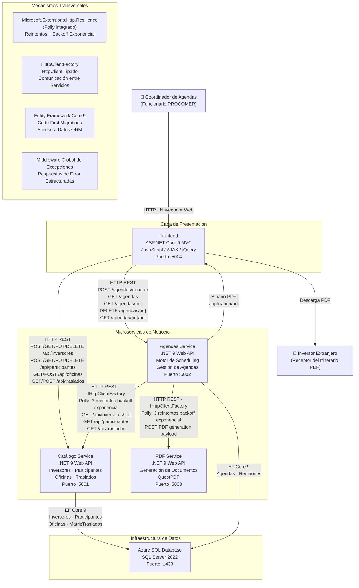
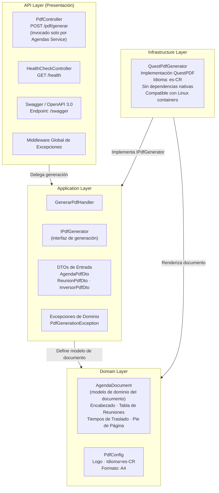
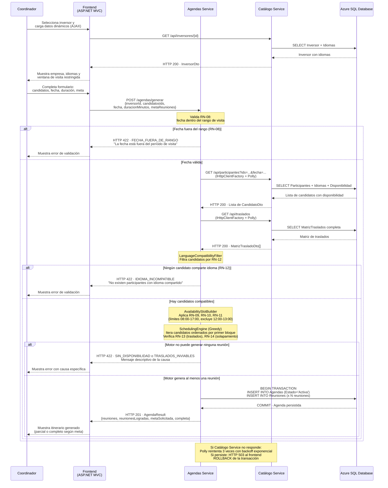
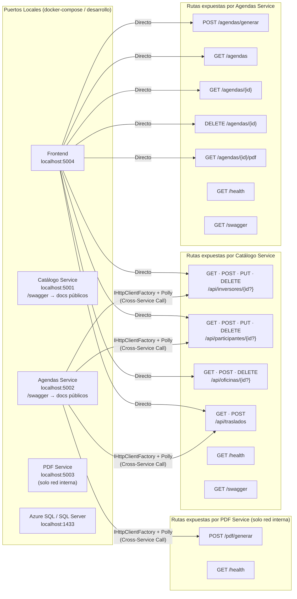

# Arquitectura del Sistema — Sistema de Calendarización de Inversores

| | |
|---|---|
| **Proyecto** | Sistema de Calendarización de Inversores |
| **ID del proyecto** | PROCOMER-CALEND-2026 |
| **Versión** | 1.0 · Junio 2026 |
| **Fecha** | Junio 2026 |
| **Stack** | .NET 9 · ASP.NET Core 9 MVC · ASP.NET Core 9 Web API · Entity Framework Core 9 · Azure SQL Database · Azure Container Apps · Azure Container Registry · QuestPDF · Microsoft.Extensions.Http.Resilience (Polly) · xUnit + Moq + FluentAssertions |
| **Contratación** | 2026XE-000001-0001700001 |
| **Documentos fuente** | `Prueba_Técnica.md` · `SPEC_Calendarizacion_Inversores.md` v1.0 |

---

## Tabla de Contenidos

1. [Vista General del Sistema (C4 — Nivel Contexto)](#1-vista-general-del-sistema-c4--nivel-contexto)
2. [Vista de Componentes — Clean Architecture por Microservicio](#2-vista-de-componentes--clean-architecture-por-microservicio)
3. [Vista de Despliegue — Azure Container Apps](#3-vista-de-despliegue--azure-container-apps)
4. [Vista de Flujo — Generación de Agenda (Operación Crítica)](#4-vista-de-flujo--generación-de-agenda-operación-crítica)
5. [Vista de Flujo — Generación de PDF del Itinerario](#5-vista-de-flujo--generación-de-pdf-del-itinerario)
6. [Estructura del Repositorio](#6-estructura-del-repositorio)
7. [Mapa de Puertos y Routing entre Servicios](#7-mapa-de-puertos-y-routing-entre-servicios)
8. [Leyenda y Decisiones de Arquitectura Clave](#8-leyenda-y-decisiones-de-arquitectura-clave)

---

## 1. Vista General del Sistema (C4 — Nivel Contexto)



---

## 2. Vista de Componentes — Clean Architecture por Microservicio

### 2.1 Catálogo Service

```mermaid
flowchart TB
    subgraph api_layer["API Layer (Presentación)"]
        inv_ctrl["InversoresController<br>GET · POST · PUT · DELETE /api/inversores"]
        part_ctrl["ParticipantesController<br>GET · POST · PUT · DELETE /api/participantes"]
        ofic_ctrl["OficinasController<br>GET · POST · DELETE /api/oficinas"]
        trasl_ctrl["TrasladosController<br>GET · POST /api/traslados"]
        health_ctrl["HealthCheckController<br>GET /health"]
        swagger_mw["Swagger / OpenAPI 3.0<br>Endpoint: /swagger"]
        exc_mw["Middleware Global de Excepciones<br>Sin stack traces en producción"]
    end

    subgraph app_layer["Application Layer"]
        inv_handler["RegistrarInversorHandler<br>ActualizarInversorHandler<br>EliminarInversorHandler<br>ConsultarInversoresHandler"]
        part_handler["RegistrarParticipanteHandler<br>ActualizarParticipanteHandler<br>DesactivarParticipanteHandler"]
        ofic_handler["RegistrarOficinaHandler<br>EliminarOficinaHandler"]
        trasl_handler["RegistrarTrasladoHandler<br>(garantiza simetría RN-07)"]
        iinv_repo["IInversorRepository"]
        ipart_repo["IParticipanteRepository"]
        iofic_repo["IOficinaRepository"]
        itrasl_repo["IMatrizTrasladoRepository"]
        dtos["DTOs de Entrada / Salida<br>InversorDto · ParticipanteDto<br>OficinaDto · TrasladoDto"]
        domain_exc["Excepciones de Dominio<br>IdiomaRequeridoException<br>FechaVisitaInvalidaException<br>InversorConAgendasActivasException<br>OficinaConParticipantesActivosException"]
    end

    subgraph domain_layer["Domain Layer"]
        inv_entity["Inversor<br>Id · NombreCompleto · Empresa<br>PaisOrigen · FechaInicioVisita<br>FechaFinVisita · LugarHospedaje"]
        part_entity["Participante<br>Id · NombreCompleto · Cargo<br>OficinaId · Estado<br>Idiomas · Disponibilidad"]
        ofic_entity["Oficina<br>Id · Nombre · Direccion<br>Latitud · Longitud (opc)"]
        idioma_entity["Idioma<br>Id · Nombre · Codigo"]
        trasl_entity["MatrizTraslado<br>OficinaOrigenId · OficinaDestinoId<br>TiempoMinutos"]
        disp_entity["DisponibilidadParticipante<br>ParticipanteId · Fecha<br>HoraInicio · HoraFin"]
    end

    subgraph infra_layer["Infrastructure Layer"]
        catalogo_ctx["CatalogoDbContext<br>Entity Framework Core 9"]
        inv_repo_impl["InversorRepository"]
        part_repo_impl["ParticipanteRepository"]
        ofic_repo_impl["OficinaRepository"]
        trasl_repo_impl["MatrizTrasladoRepository<br>(escribe par simétrico en transacción)"]
        migrations["EF Core Migrations<br>/Migrations/"]
    end

    api_layer -->|"Delega casos de uso"| app_layer
    app_layer -->|"Define contrato"| domain_layer
    infra_layer -->|"Implementa interfaces"| app_layer
    infra_layer -->|"Persiste entidades"| domain_layer
```



### 2.2 Agendas Service

```mermaid
flowchart TB
    subgraph api_layer_ag["API Layer (Presentación)"]
        ag_ctrl["AgendasController<br>POST /agendas/generar<br>GET /agendas<br>GET /agendas/{id}<br>DELETE /agendas/{id}<br>GET /agendas/{id}/pdf"]
        health_ag["HealthCheckController<br>GET /health"]
        swagger_ag["Swagger / OpenAPI 3.0<br>Endpoint: /swagger"]
        exc_ag["Middleware Global de Excepciones"]
    end

    subgraph app_layer_ag["Application Layer"]
        gen_handler["GenerarAgendaHandler"]
        consult_handler["ConsultarAgendasHandler<br>ConsultarAgendaDetalleHandler"]
        anular_handler["AnularAgendaHandler"]
        pdf_handler["DescargarPdfAgendaHandler"]
        scheduling_engine["SchedulingEngine<br>Algoritmo Greedy<br>(ver SPEC §8)"]
        lang_filter["LanguageCompatibilityFilter<br>(RN-12)"]
        slot_builder["AvailabilitySlotBuilder<br>(RN-09 · RN-10 · RN-11)"]
        travel_resolver["TravelTimeResolver<br>(RN-13)"]
        iag_repo["IAgendaRepository"]
        icatalogo_client["ICatalogoServiceClient<br>(IHttpClientFactory tipado)"]
        ipdf_client["IPdfServiceClient<br>(IHttpClientFactory tipado)"]
        ag_dtos["DTOs<br>AgendaRequest · AgendaResult<br>AgendaPdfDto · ReunionDto"]
        ag_exc["Excepciones de Dominio<br>FechaFueraDeRangoException<br>IdiomaIncompatibleException<br>AgendaNotFoundException<br>CatalogoServiceNoDisponibleException<br>PdfServiceNoDisponibleException"]
    end

    subgraph domain_layer_ag["Domain Layer"]
        agenda_entity["Agenda<br>Id · InversorId · Fecha<br>Estado · FechaGeneracion<br>FechaAnulacion"]
        reunion_entity["Reunion<br>Id · AgendaId · ParticipanteId<br>HoraInicio · HoraFin · OficinaId<br>IdiomaReunion · Orden<br>TiempoTrasladoSiguiente"]
        agenda_estado["AgendaEstado (Enum)<br>Activa · Anulada"]
        scheduling_error["SchedulingError (Enum)<br>IDIOMA_INCOMPATIBLE<br>SIN_DISPONIBILIDAD<br>FECHA_FUERA_DE_RANGO<br>TRASLADOS_INVIABLES"]
    end

    subgraph infra_layer_ag["Infrastructure Layer"]
        ag_ctx["AgendasDbContext<br>Entity Framework Core 9"]
        ag_repo_impl["AgendaRepository"]
        catalogo_http["CatalogoServiceClient<br>HttpClient con Polly<br>3 reintentos + backoff exponencial"]
        pdf_http["PdfServiceClient<br>HttpClient con Polly<br>3 reintentos + backoff exponencial"]
        ag_migrations["EF Core Migrations<br>/Migrations/"]
    end

    api_layer_ag -->|"Delega casos de uso"| app_layer_ag
    app_layer_ag -->|"Define contrato"| domain_layer_ag
    infra_layer_ag -->|"Implementa interfaces"| app_layer_ag
    infra_layer_ag -->|"Persiste entidades"| domain_layer_ag
```



### 2.3 PDF Service



---

## 3. Vista de Despliegue — Azure Container Apps

```mermaid
flowchart LR
    browser["🌐 Navegador del<br>Coordinador<br>(Host externo)"]

    subgraph azure_rg["Resource Group: rsgr-E02-TST-EaUS"]
        subgraph acr["Azure Container Registry: acre02prd<br>(acre02prd.azurecr.io)"]
            img_front["imagen:<br>frontend-mvc:latest"]
            img_catalogo["imagen:<br>catalogo-api:latest"]
            img_agendas["imagen:<br>agendas-api:latest"]
            img_pdf["imagen:<br>pdf-api:latest"]
        end

        subgraph aca_env["Container Apps Environment: rs-cae-e02-tst-4e4d-eaus-1<br>(red interna compartida)"]
            subgraph aca_front["Container App: frontend-mvc<br>Ingress: EXTERNO · Puerto 443/80"]
                app_front["ASP.NET Core 9 MVC<br>Puerto interno :8080"]
            end

            subgraph aca_catalogo["Container App: catalogo-api<br>Ingress: EXTERNO (Swagger) · Puerto 443/80"]
                app_catalogo["Catálogo Service<br>ASP.NET Core 9 Web API<br>Puerto interno :8080"]
            end

            subgraph aca_agendas["Container App: agendas-api<br>Ingress: EXTERNO (Swagger) · Puerto 443/80"]
                app_agendas["Agendas Service<br>ASP.NET Core 9 Web API<br>Puerto interno :8080"]
            end

            subgraph aca_pdf["Container App: pdf-api<br>Ingress: EXTERNO · Puerto 443/80"]
                app_pdf["PDF Service<br>ASP.NET Core 9 Web API<br>Puerto interno :8080"]
            end
        end

        sqldb_az["Azure SQL Database<br>Servidor: rs-dbs-pte02-tst-4e4d-eaus-1.database.windows.net<br>Base de datos: PROInversores<br>Puerto :1433<br>(Firewall: solo Container Apps)"]
    end

    browser -->|"HTTPS<br>URL pública"| aca_front
    app_front -->|"HTTP REST<br>URL pública Catálogo"| aca_catalogo
    app_front -->|"HTTP REST<br>URL pública Agendas"| aca_agendas
    app_agendas -->|"HTTP REST<br>Red interna Container Apps<br>IHttpClientFactory + Polly"| aca_catalogo
    app_agendas -->|"HTTP REST<br>Red interna Container Apps<br>IHttpClientFactory + Polly"| aca_pdf
    app_catalogo -->|"Azure SQL<br>EF Core 9<br>Tablas: Inversores · Participantes<br>Oficinas · Traslados"| sqldb_az
    app_agendas -->|"Azure SQL<br>EF Core 9<br>Tablas: Agendas · Reuniones"| sqldb_az
```



> **Nota de acceso desde el host:** El navegador del coordinador accede a `frontend-mvc` y a los endpoints `/swagger` de `catalogo-api` y `agendas-api` (para verificación del panel evaluador). `pdf-api` expone ingress externo pero es invocado exclusivamente por `agendas-api` vía HTTP REST; no forma parte del flujo directo del usuario.

---

## 4. Vista de Flujo — Generación de Agenda (Operación Crítica)



---

## 5. Vista de Flujo — Generación de PDF del Itinerario

```mermaid
sequenceDiagram
    participant coord as Coordinador
    participant front as Frontend<br>(ASP.NET MVC)
    participant agendas as Agendas Service
    participant pdf as PDF Service
    participant sqldb as Azure SQL Database

    coord->>front: Hace clic en "Descargar PDF"<br>para una agenda activa o anulada
    front->>agendas: GET /agendas/{id}/pdf

    agendas->>sqldb: SELECT Agenda + Reuniones<br>+ Participantes + Oficinas
    sqldb-->>agendas: Datos completos de la agenda

    alt Agenda no encontrada
        agendas-->>front: HTTP 404 · AgendaNotFoundException<br>"La agenda solicitada no existe"
        front-->>coord: Muestra mensaje de error
    else Agenda encontrada (Activa o Anulada)
        Note over agendas: Construye AgendaPdfDto<br>con todos los datos del itinerario

        agendas->>pdf: POST /pdf/generar<br>{AgendaPdfDto: inversor, reuniones,<br>traslados, fecha, idioma=es-CR}<br>(IHttpClientFactory + Polly)

        Note over pdf: GenerarPdfHandler<br>QuestPdfGenerator<br>Idioma: es-CR · Formato: A4

        Note over pdf: Estructura del documento:<br>1. Encabezado institucional + logo + nombre inversor<br>2. Fecha de la jornada<br>3. Tabla de reuniones (hora inicio/fin, participante,<br>   cargo, oficina, dirección, idioma reunión)<br>4. Tiempos de traslado entre reuniones consecutivas<br>5. Pie de página: numeración + fecha generación

        pdf-->>agendas: HTTP 200 · Binario PDF<br>Content-Type: application/pdf

        agendas-->>front: HTTP 200 · Binario PDF<br>Content-Type: application/pdf<br>Content-Disposition: attachment;<br>filename="Agenda_{Fecha}_{NombreInversor}.pdf"
        front-->>coord: Navegador descarga el archivo PDF
    end

    Note over agendas,pdf: Si PDF Service no responde:<br>Polly reintenta 3 veces con backoff exponencial<br>Si persiste: HTTP 504 al frontend<br>"Servicio de generación no disponible, reintente"
```

---

## 6. Estructura del Repositorio

```
PROCOMER-CALEND-2026/
│
├── src/
│   ├── Catalogo/
│   │   ├── Catalogo.Domain/
│   │   │   ├── Entities/
│   │   │   │   ├── Inversor.cs
│   │   │   │   ├── Participante.cs
│   │   │   │   ├── Oficina.cs
│   │   │   │   ├── Idioma.cs
│   │   │   │   ├── InversorIdioma.cs
│   │   │   │   ├── ParticipanteIdioma.cs
│   │   │   │   ├── DisponibilidadParticipante.cs
│   │   │   │   └── MatrizTraslado.cs
│   │   │   └── Enums/
│   │   │       └── EstadoParticipante.cs
│   │   ├── Catalogo.Application/
│   │   │   ├── Inversores/
│   │   │   │   ├── RegistrarInversorHandler.cs
│   │   │   │   ├── ActualizarInversorHandler.cs
│   │   │   │   ├── EliminarInversorHandler.cs
│   │   │   │   └── ConsultarInversoresHandler.cs
│   │   │   ├── Participantes/
│   │   │   │   ├── RegistrarParticipanteHandler.cs
│   │   │   │   ├── ActualizarParticipanteHandler.cs
│   │   │   │   └── DesactivarParticipanteHandler.cs
│   │   │   ├── Oficinas/
│   │   │   │   ├── RegistrarOficinaHandler.cs
│   │   │   │   └── EliminarOficinaHandler.cs
│   │   │   ├── Traslados/
│   │   │   │   └── RegistrarTrasladoHandler.cs
│   │   │   ├── Interfaces/
│   │   │   │   ├── IInversorRepository.cs
│   │   │   │   ├── IParticipanteRepository.cs
│   │   │   │   ├── IOficinaRepository.cs
│   │   │   │   └── IMatrizTrasladoRepository.cs
│   │   │   ├── DTOs/
│   │   │   │   ├── InversorDto.cs
│   │   │   │   ├── ParticipanteDto.cs
│   │   │   │   ├── OficinaDto.cs
│   │   │   │   └── TrasladoDto.cs
│   │   │   └── Exceptions/
│   │   │       ├── IdiomaRequeridoException.cs
│   │   │       ├── FechaVisitaInvalidaException.cs
│   │   │       ├── InversorConAgendasActivasException.cs
│   │   │       └── OficinaConParticipantesActivosException.cs
│   │   ├── Catalogo.Infrastructure/
│   │   │   ├── Persistence/
│   │   │   │   ├── CatalogoDbContext.cs
│   │   │   │   ├── Configurations/
│   │   │   │   │   ├── InversorConfiguration.cs
│   │   │   │   │   ├── ParticipanteConfiguration.cs
│   │   │   │   │   ├── OficinaConfiguration.cs
│   │   │   │   │   └── MatrizTrasladoConfiguration.cs
│   │   │   │   └── Migrations/
│   │   │   └── Repositories/
│   │   │       ├── InversorRepository.cs
│   │   │       ├── ParticipanteRepository.cs
│   │   │       ├── OficinaRepository.cs
│   │   │       └── MatrizTrasladoRepository.cs
│   │   └── Catalogo.API/
│   │       ├── Controllers/
│   │       │   ├── InversoresController.cs
│   │       │   ├── ParticipantesController.cs
│   │       │   ├── OficinasController.cs
│   │       │   ├── TrasladosController.cs
│   │       │   └── HealthController.cs
│   │       ├── Middleware/
│   │       │   └── GlobalExceptionMiddleware.cs
│   │       ├── Program.cs
│   │       ├── appsettings.json
│   │       ├── appsettings.Production.json
│   │       └── Dockerfile
│   │
│   ├── Agendas/
│   │   ├── Agendas.Domain/
│   │   │   ├── Entities/
│   │   │   │   ├── Agenda.cs
│   │   │   │   └── Reunion.cs
│   │   │   └── Enums/
│   │   │       ├── AgendaEstado.cs
│   │   │       └── SchedulingErrorCode.cs
│   │   ├── Agendas.Application/
│   │   │   ├── Agendas/
│   │   │   │   ├── GenerarAgendaHandler.cs
│   │   │   │   ├── ConsultarAgendasHandler.cs
│   │   │   │   ├── ConsultarAgendaDetalleHandler.cs
│   │   │   │   ├── AnularAgendaHandler.cs
│   │   │   │   └── DescargarPdfAgendaHandler.cs
│   │   │   ├── Scheduling/
│   │   │   │   ├── ISchedulingEngine.cs
│   │   │   │   ├── SchedulingEngine.cs
│   │   │   │   ├── ILanguageCompatibilityFilter.cs
│   │   │   │   ├── LanguageCompatibilityFilter.cs
│   │   │   │   ├── IAvailabilitySlotBuilder.cs
│   │   │   │   ├── AvailabilitySlotBuilder.cs
│   │   │   │   ├── ITravelTimeResolver.cs
│   │   │   │   └── TravelTimeResolver.cs
│   │   │   ├── Interfaces/
│   │   │   │   ├── IAgendaRepository.cs
│   │   │   │   ├── ICatalogoServiceClient.cs
│   │   │   │   └── IPdfServiceClient.cs
│   │   │   ├── DTOs/
│   │   │   │   ├── AgendaRequest.cs
│   │   │   │   ├── AgendaResult.cs
│   │   │   │   ├── AgendaPdfDto.cs
│   │   │   │   ├── ReunionDto.cs
│   │   │   │   └── CandidatoAgendaDto.cs
│   │   │   └── Exceptions/
│   │   │       ├── FechaFueraDeRangoException.cs
│   │   │       ├── IdiomaIncompatibleException.cs
│   │   │       ├── AgendaNotFoundException.cs
│   │   │       ├── AgendaYaAnuladaException.cs
│   │   │       ├── CatalogoServiceNoDisponibleException.cs
│   │   │       └── PdfServiceNoDisponibleException.cs
│   │   ├── Agendas.Infrastructure/
│   │   │   ├── Persistence/
│   │   │   │   ├── AgendasDbContext.cs
│   │   │   │   ├── Configurations/
│   │   │   │   │   ├── AgendaConfiguration.cs
│   │   │   │   │   └── ReunionConfiguration.cs
│   │   │   │   └── Migrations/
│   │   │   ├── Repositories/
│   │   │   │   └── AgendaRepository.cs
│   │   │   └── HttpClients/
│   │   │       ├── CatalogoServiceClient.cs
│   │   │       └── PdfServiceClient.cs
│   │   └── Agendas.API/
│   │       ├── Controllers/
│   │       │   ├── AgendasController.cs
│   │       │   └── HealthController.cs
│   │       ├── Middleware/
│   │       │   └── GlobalExceptionMiddleware.cs
│   │       ├── Program.cs
│   │       ├── appsettings.json
│   │       ├── appsettings.Production.json
│   │       └── Dockerfile
│   │
│   ├── PDF/
│   │   ├── PDF.Domain/
│   │   │   └── Models/
│   │   │       ├── AgendaDocument.cs
│   │   │       └── PdfConfig.cs
│   │   ├── PDF.Application/
│   │   │   ├── Handlers/
│   │   │   │   └── GenerarPdfHandler.cs
│   │   │   ├── Interfaces/
│   │   │   │   └── IPdfGenerator.cs
│   │   │   ├── DTOs/
│   │   │   │   ├── AgendaPdfDto.cs
│   │   │   │   └── ReunionPdfDto.cs
│   │   │   └── Exceptions/
│   │   │       └── PdfGenerationException.cs
│   │   ├── PDF.Infrastructure/
│   │   │   └── Generators/
│   │   │       └── QuestPdfGenerator.cs
│   │   └── PDF.API/
│   │       ├── Controllers/
│   │       │   ├── PdfController.cs
│   │       │   └── HealthController.cs
│   │       ├── Middleware/
│   │       │   └── GlobalExceptionMiddleware.cs
│   │       ├── Program.cs
│   │       ├── appsettings.json
│   │       └── Dockerfile
│   │
│   └── Frontend/
│       ├── Controllers/
│       │   ├── InversoresController.cs
│       │   ├── ParticipantesController.cs
│       │   ├── OficinasController.cs
│       │   ├── TrasladosController.cs
│       │   └── AgendasController.cs
│       ├── Views/
│       │   ├── Inversores/
│       │   │   ├── Index.cshtml
│       │   │   ├── Create.cshtml
│       │   │   └── Edit.cshtml
│       │   ├── Participantes/
│       │   │   ├── Index.cshtml
│       │   │   ├── Create.cshtml
│       │   │   └── Edit.cshtml
│       │   ├── Oficinas/
│       │   │   ├── Index.cshtml
│       │   │   └── Create.cshtml
│       │   ├── Traslados/
│       │   │   └── Index.cshtml
│       │   └── Agendas/
│       │       ├── Generar.cshtml
│       │       ├── Index.cshtml
│       │       └── Detalle.cshtml
│       ├── wwwroot/
│       │   ├── js/
│       │   │   ├── inversores.js
│       │   │   ├── agendas.js
│       │   │   └── site.js
│       │   └── css/
│       │       └── site.css
│       ├── Program.cs
│       ├── appsettings.json
│       └── Dockerfile
│
├── tests/
│   └── Agendas.UnitTests/
│       ├── Scheduling/
│       │   ├── SchedulingEngineTests.cs
│       │   │   ├── UT-02: Genera agenda con 3 reuniones dentro del rango de visita
│       │   │   ├── UT-04: Rechaza cuando ningún candidato comparte idioma (RN-12)
│       │   │   └── UT-05: Rechaza fecha fuera del rango de visita (RN-08)
│       │   └── TravelTimeResolverTests.cs
│       │       └── UT-01: Calcula correctamente el tiempo de traslado entre dos oficinas
│       └── Services/
│           └── AgendaServiceTests.cs
│               └── UT-03: Anulación lógica cambia estado sin eliminar registro (RN-15)
│
├── scripts/
│   └── database/
│       ├── 001_schema.sql
│       └── 002_seed.sql
│
├── .github/
│   └── workflows/
│       └── ci-cd.yml
│
├── docker-compose.yml
├── docker-compose.override.yml
└── README.md
```

---

## 7. Mapa de Puertos y Routing entre Servicios



> **Sin API Gateway:** El frontend ASP.NET MVC consume directamente las URLs públicas de cada Container App. No se utiliza YARP ni ningún otro proxy inverso centralizado, según lo especificado en el SPEC §2 y la Prueba Técnica §5.1.

---

## 8. Leyenda y Decisiones de Arquitectura Clave

| Decisión | Consecuencia visible en los diagramas | Referencia SPEC |
|---|---|---|
| **Sin API Gateway centralizado** | El frontend tiene flechas directas hacia Catálogo Service y Agendas Service (no hay un nodo intermediario). Cada microservicio expone ingress externo propio en Azure Container Apps. | SPEC §2 · Prueba Técnica §5.1 |
| **PDF Service con ingress interno únicamente** | En el diagrama de despliegue, el PDF Service no tiene flecha desde el navegador del coordinador. Solo recibe tráfico desde Agendas Service dentro de la red del Container Apps Environment. | SPEC §4.3 · AC-06 |
| **Clean Architecture en los tres microservicios backend** | Cada microservicio se representa con cuatro subgrafos (API ← Infrastructure ← Application ← Domain). Las flechas de dependencia fluyen siempre de afuera hacia adentro; nunca Domain → Application ni Application → Infrastructure. | SPEC §4 · Prueba Técnica §5.1 |
| **IHttpClientFactory tipado con Polly para llamadas entre servicios** | En la Vista de Componentes de Agendas Service, existe `ICatalogoServiceClient` e `IPdfServiceClient` en la capa Application, implementados en Infrastructure. Las políticas de resiliencia (3 reintentos + backoff exponencial) se configuran en Infrastructure. | SPEC §4.2 (Requisitos NFR) · AC-09 |
| **Simetría de MatrizTraslado garantizada en Application Layer** | El `RegistrarTrasladoHandler` del Catálogo Service siempre persiste dos registros (A→B y B→A) en la misma transacción. No hay lógica de simetría en la capa API ni en la base de datos. | RN-07 · AC-03 |
| **Soft delete (anulación lógica) para agendas** | En el diagrama de flujo de anulación, la operación es un UPDATE (Estado='Anulada', FechaAnulacion=NOW()) y nunca un DELETE físico. El PDF sigue disponible después de la anulación. | RN-15 · AC-07 |
| **Motor de scheduling sin acceso directo a la base de datos** | `SchedulingEngine`, `LanguageCompatibilityFilter`, `AvailabilitySlotBuilder` y `TravelTimeResolver` están en la capa Application y reciben datos ya cargados como parámetros. La consulta a la base de datos ocurre antes de invocar el motor, en `GenerarAgendaHandler`. | SPEC §8 |
| **Una única Azure SQL Database compartida** | En el diagrama de despliegue, Catálogo Service y Agendas Service apuntan al mismo nodo de Azure SQL Database. Se usan esquemas o prefijos de tabla separados por dominio para aislar las entidades de cada servicio (DP-02 resuelto como base compartida). | SPEC §6 · DP-02 |
| **QuestPDF como biblioteca de generación de PDF** | En la capa Infrastructure del PDF Service existe únicamente `QuestPdfGenerator` (sin dependencias de GDI+, fuentes nativas del SO ni librerías externas de sistema). Compatible con imágenes Linux en Azure Container Apps. | SPEC §6 · R-04 · DP-01 |
| **Swagger accesible públicamente en los tres microservicios backend** | En el diagrama de despliegue, Catálogo Service y Agendas Service tienen ingress externo. El PDF Service no expone Swagger públicamente dado que solo lo consume Agendas Service internamente. | SPEC §4 · Prueba Técnica §5.2 · E-04 |
| **Middleware global de excepciones en todos los servicios** | En la Vista de Componentes, cada capa API incluye un nodo `GlobalExceptionMiddleware`. Ninguna excepción de dominio ni stack trace se expone en las respuestas HTTP de producción. | SPEC §4 |
| **Punto de hospedaje del inversor como OficinaId virtual de partida** | En el flujo de generación de agenda, `SchedulingEngine` inicializa `ultimaOficinaId` con el `PuntoPartidaId` del inversor para calcular el primer traslado. Si no existe el par en la MatrizTraslados, se asume tiempo cero y se registra advertencia en el log. | SPEC §8 |

---

*Documento generado como artefacto del Gate 1 — PROCOMER-CALEND-2026. Versión 1.0 · Junio 2026.*
