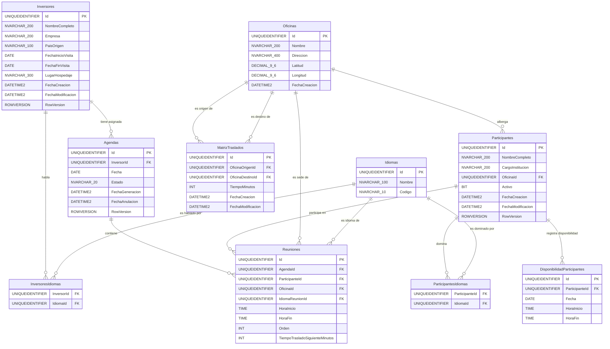

# Modelo Entidad-Relación — Sistema de Calendarización de Inversores

| | |
|---|---|
| **Proyecto** | Sistema de Calendarización de Inversores |
| **ID del proyecto** | PROCOMER-CALEND-2026 |
| **Versión** | 1.0 · Junio 2026 |
| **Fecha** | Junio 2026 |
| **Motor de base de datos** | Azure SQL Database (SQL Server 2022) |
| **ORM** | Entity Framework Core 9 · Code First Migrations |
| **Documentos fuente** | `Prueba_Técnica.md` · `SPEC_Calendarizacion_Inversores.md` v1.0 |

---

## Tabla de Contenidos

1. [Diagrama ER](#1-diagrama-er)
2. [Descripción de Entidades](#2-descripción-de-entidades)
   - [Inversores](#inversores)
   - [Idiomas](#idiomas)
   - [InversoresIdiomas](#inversoresidiomas)
   - [Participantes](#participantes)
   - [ParticipantesIdiomas](#participantesidiomas)
   - [DisponibilidadParticipantes](#disponibilidadparticipantes)
   - [Oficinas](#oficinas)
   - [MatrizTraslados](#matriztraslados)
   - [Agendas](#agendas)
   - [Reuniones](#reuniones)
3. [Reglas de Integridad Referencial](#3-reglas-de-integridad-referencial)
4. [Configuración de EF Core 9 por Entidad](#4-configuración-de-ef-core-9-por-entidad)

---

## 1. Diagrama ER



> **Nota de partición:** Las tablas `Inversores`, `Idiomas`, `InversoresIdiomas`, `Participantes`, `ParticipantesIdiomas`, `DisponibilidadParticipantes`, `Oficinas` y `MatrizTraslados` son propiedad del **Catálogo Service** (`CatalogoDbContext`). Las tablas `Agendas` y `Reuniones` son propiedad del **Agendas Service** (`AgendasDbContext`). Ambos contextos comparten la misma Azure SQL Database pero operan sobre conjuntos de tablas disjuntos, sin relaciones de FK cruzadas entre contextos.

---

## 2. Descripción de Entidades

### Inversores

Almacena los datos del visitante extranjero que será agendado. Es la entidad raíz del flujo de scheduling: sin un inversor con idiomas y ventana de visita válidos no puede generarse ninguna agenda.

| Campo | Tipo SQL Server | Nullable | PK/FK | Descripción | Restricciones |
|---|---|---|---|---|---|
| `Id` | `UNIQUEIDENTIFIER` | NO | PK | Identificador único del inversor. | `DEFAULT NEWSEQUENTIALID()` |
| `NombreCompleto` | `NVARCHAR(200)` | NO | — | Nombre completo del visitante. | `NOT NULL`, máx. 200 caracteres |
| `Empresa` | `NVARCHAR(200)` | NO | — | Nombre de la empresa que representa. | `NOT NULL`, máx. 200 caracteres |
| `PaisOrigen` | `NVARCHAR(100)` | NO | — | País desde el que viaja. | `NOT NULL`, máx. 100 caracteres |
| `FechaInicioVisita` | `DATE` | NO | — | Primer día de la visita. | `NOT NULL`; debe ser ≤ `FechaFinVisita` (RN-02) |
| `FechaFinVisita` | `DATE` | NO | — | Último día de la visita. | `NOT NULL`; debe ser ≥ `FechaInicioVisita` (RN-02) |
| `LugarHospedaje` | `NVARCHAR(300)` | NO | — | Lugar de hospedaje o punto de partida diario. | `NOT NULL`, máx. 300 caracteres |
| `FechaCreacion` | `DATETIME2` | NO | — | Timestamp de inserción del registro. | `DEFAULT SYSUTCDATETIME()` |
| `FechaModificacion` | `DATETIME2` | NO | — | Timestamp de última actualización. | `DEFAULT SYSUTCDATETIME()`; actualizado en cada UPDATE |
| `RowVersion` | `ROWVERSION` | NO | — | Token de concurrencia optimista gestionado por SQL Server. | Automático; mapeado con `IsRowVersion()` |

**Índices recomendados:**

| Índice | Columnas | Tipo | Justificación |
|---|---|---|---|
| `PK_Inversores` | `Id` | Clustered (PK) | Acceso primario |
| `IX_Inversores_FechaInicioVisita` | `FechaInicioVisita` | Non-Clustered | Filtros por rango de visita en scheduling (RN-08) |

---

### Idiomas

Catálogo cerrado de idiomas soportados por el sistema (mínimo: español, inglés). Entidad inmutable en operación normal; solo se modifican por scripts de mantenimiento.

> **Entidad de solo lectura en operación.** No se expone endpoint de creación/eliminación de idiomas al coordinador.

| Campo | Tipo SQL Server | Nullable | PK/FK | Descripción | Restricciones |
|---|---|---|---|---|---|
| `Id` | `UNIQUEIDENTIFIER` | NO | PK | Identificador único del idioma. | `DEFAULT NEWSEQUENTIALID()` |
| `Nombre` | `NVARCHAR(100)` | NO | — | Nombre legible del idioma (ej. "Español"). | `NOT NULL`, `UNIQUE`, máx. 100 caracteres |
| `Codigo` | `NVARCHAR(10)` | NO | — | Código ISO 639-1 del idioma (ej. "es", "en"). | `NOT NULL`, `UNIQUE`, máx. 10 caracteres |

**Índices recomendados:**

| Índice | Columnas | Tipo | Justificación |
|---|---|---|---|
| `PK_Idiomas` | `Id` | Clustered (PK) | Acceso primario |
| `UX_Idiomas_Codigo` | `Codigo` | Non-Clustered Unique | Evita códigos ISO duplicados |

---

### InversoresIdiomas

Tabla de unión N:M entre `Inversores` e `Idiomas`. Persiste qué idiomas domina cada inversor. La clave primaria es compuesta (par `InversorId + IdiomaId`).

| Campo | Tipo SQL Server | Nullable | PK/FK | Descripción | Restricciones |
|---|---|---|---|---|---|
| `InversorId` | `UNIQUEIDENTIFIER` | NO | PK + FK → Inversores | Referencia al inversor. | `NOT NULL`; ON DELETE CASCADE |
| `IdiomaId` | `UNIQUEIDENTIFIER` | NO | PK + FK → Idiomas | Referencia al idioma. | `NOT NULL`; ON DELETE RESTRICT |

**Índices recomendados:**

| Índice | Columnas | Tipo | Justificación |
|---|---|---|---|
| `PK_InversoresIdiomas` | `InversorId, IdiomaId` | Clustered (PK compuesta) | Acceso por par; garantiza unicidad |
| `IX_InversoresIdiomas_IdiomaId` | `IdiomaId` | Non-Clustered | Consultas inversas (¿qué inversores hablan X idioma?) |

---

### Participantes

Almacena a los funcionarios o representantes institucionales que pueden ser convocados a reuniones. El estado `Activo` controla si el participante está disponible para el scheduling sin eliminar el registro histórico.

| Campo | Tipo SQL Server | Nullable | PK/FK | Descripción | Restricciones |
|---|---|---|---|---|---|
| `Id` | `UNIQUEIDENTIFIER` | NO | PK | Identificador único del participante. | `DEFAULT NEWSEQUENTIALID()` |
| `NombreCompleto` | `NVARCHAR(200)` | NO | — | Nombre completo del participante. | `NOT NULL`, máx. 200 caracteres |
| `CargoInstitucion` | `NVARCHAR(200)` | NO | — | Cargo o institución a la que pertenece. | `NOT NULL`, máx. 200 caracteres |
| `OficinaId` | `UNIQUEIDENTIFIER` | NO | FK → Oficinas | Oficina donde habitualmente atiende reuniones (RN-05). | `NOT NULL`; ON DELETE RESTRICT |
| `Activo` | `BIT` | NO | — | Indica si el participante está disponible para scheduling. | `NOT NULL`; `DEFAULT 1` |
| `FechaCreacion` | `DATETIME2` | NO | — | Timestamp de inserción del registro. | `DEFAULT SYSUTCDATETIME()` |
| `FechaModificacion` | `DATETIME2` | NO | — | Timestamp de última actualización. | `DEFAULT SYSUTCDATETIME()` |
| `RowVersion` | `ROWVERSION` | NO | — | Token de concurrencia optimista. | Automático |

**Índices recomendados:**

| Índice | Columnas | Tipo | Justificación |
|---|---|---|---|
| `PK_Participantes` | `Id` | Clustered (PK) | Acceso primario |
| `IX_Participantes_OficinaId` | `OficinaId` | Non-Clustered | Consultas de participantes por oficina; validación de RN-06 |
| `IX_Participantes_Activo` | `Activo` | Non-Clustered | Filtro de participantes activos en scheduling |

---

### ParticipantesIdiomas

Tabla de unión N:M entre `Participantes` e `Idiomas`. Persiste qué idiomas domina cada participante. La clave primaria es compuesta.

| Campo | Tipo SQL Server | Nullable | PK/FK | Descripción | Restricciones |
|---|---|---|---|---|---|
| `ParticipanteId` | `UNIQUEIDENTIFIER` | NO | PK + FK → Participantes | Referencia al participante. | `NOT NULL`; ON DELETE CASCADE |
| `IdiomaId` | `UNIQUEIDENTIFIER` | NO | PK + FK → Idiomas | Referencia al idioma. | `NOT NULL`; ON DELETE RESTRICT |

**Índices recomendados:**

| Índice | Columnas | Tipo | Justificación |
|---|---|---|---|
| `PK_ParticipantesIdiomas` | `ParticipanteId, IdiomaId` | Clustered (PK compuesta) | Acceso por par; garantiza unicidad |
| `IX_ParticipantesIdiomas_IdiomaId` | `IdiomaId` | Non-Clustered | Consultas de compatibilidad de idioma (RN-12) |

---

### DisponibilidadParticipantes

Registra los bloques horarios en los que cada participante está disponible para ser agendado en una fecha específica. El motor de scheduling (`AvailabilitySlotBuilder`) consulta esta tabla para construir los slots válidos respetando las restricciones RN-09, RN-10 y RN-11.

| Campo | Tipo SQL Server | Nullable | PK/FK | Descripción | Restricciones |
|---|---|---|---|---|---|
| `Id` | `UNIQUEIDENTIFIER` | NO | PK | Identificador único del bloque de disponibilidad. | `DEFAULT NEWSEQUENTIALID()` |
| `ParticipanteId` | `UNIQUEIDENTIFIER` | NO | FK → Participantes | Referencia al participante dueño del bloque. | `NOT NULL`; ON DELETE CASCADE |
| `Fecha` | `DATE` | NO | — | Fecha a la que aplica el bloque. | `NOT NULL` |
| `HoraInicio` | `TIME` | NO | — | Hora de inicio del bloque disponible. | `NOT NULL`; debe ser ≥ 08:00 (RN-09) |
| `HoraFin` | `TIME` | NO | — | Hora de fin del bloque disponible. | `NOT NULL`; debe ser ≤ 17:00 (RN-10); no puede solaparse con 12:00-13:00 (RN-11) |

**Índices recomendados:**

| Índice | Columnas | Tipo | Justificación |
|---|---|---|---|
| `PK_DisponibilidadParticipantes` | `Id` | Clustered (PK) | Acceso primario |
| `IX_Disponibilidad_ParticipanteId_Fecha` | `ParticipanteId, Fecha` | Non-Clustered | Consulta de disponibilidad por participante y fecha durante scheduling (operación crítica) |

---

### Oficinas

Almacena las ubicaciones físicas donde se realizan las reuniones. Las oficinas son el nodo base de la `MatrizTraslados` y la asignación obligatoria de cada participante.

| Campo | Tipo SQL Server | Nullable | PK/FK | Descripción | Restricciones |
|---|---|---|---|---|---|
| `Id` | `UNIQUEIDENTIFIER` | NO | PK | Identificador único de la oficina. | `DEFAULT NEWSEQUENTIALID()` |
| `Nombre` | `NVARCHAR(200)` | NO | — | Nombre identificable de la oficina. | `NOT NULL`, máx. 200 caracteres |
| `Direccion` | `NVARCHAR(400)` | NO | — | Dirección física completa. | `NOT NULL`, máx. 400 caracteres |
| `Latitud` | `DECIMAL(9,6)` | SÍ | — | Coordenada geográfica de latitud. | Opcional; rango válido: -90 a 90 |
| `Longitud` | `DECIMAL(9,6)` | SÍ | — | Coordenada geográfica de longitud. | Opcional; rango válido: -180 a 180 |
| `FechaCreacion` | `DATETIME2` | NO | — | Timestamp de inserción del registro. | `DEFAULT SYSUTCDATETIME()` |

**Índices recomendados:**

| Índice | Columnas | Tipo | Justificación |
|---|---|---|---|
| `PK_Oficinas` | `Id` | Clustered (PK) | Acceso primario |
| `IX_Oficinas_Nombre` | `Nombre` | Non-Clustered | Búsquedas por nombre al registrar traslados |

---

### MatrizTraslados

Almacena los tiempos de desplazamiento en minutos entre pares de oficinas. Toda fila tiene su par simétrico garantizado en la misma transacción (RN-07): si existe `A → B`, también existe `B → A` con el mismo `TiempoMinutos`. El Agendas Service consulta esta tabla a través del Catálogo Service para validar la viabilidad del traslado entre reuniones consecutivas (RN-13).

| Campo | Tipo SQL Server | Nullable | PK/FK | Descripción | Restricciones |
|---|---|---|---|---|---|
| `Id` | `UNIQUEIDENTIFIER` | NO | PK | Identificador único del par de traslado. | `DEFAULT NEWSEQUENTIALID()` |
| `OficinaOrigenId` | `UNIQUEIDENTIFIER` | NO | FK → Oficinas | Oficina de partida del traslado. | `NOT NULL`; ON DELETE CASCADE |
| `OficinaDestinoId` | `UNIQUEIDENTIFIER` | NO | FK → Oficinas | Oficina de llegada del traslado. | `NOT NULL`; ON DELETE CASCADE |
| `TiempoMinutos` | `INT` | NO | — | Tiempo estimado de traslado en minutos. | `NOT NULL`; valor ≥ 0 |
| `FechaCreacion` | `DATETIME2` | NO | — | Timestamp de inserción del registro. | `DEFAULT SYSUTCDATETIME()` |
| `FechaModificacion` | `DATETIME2` | NO | — | Timestamp de última modificación. | `DEFAULT SYSUTCDATETIME()` |

**Índices recomendados:**

| Índice | Columnas | Tipo | Justificación |
|---|---|---|---|
| `PK_MatrizTraslados` | `Id` | Clustered (PK) | Acceso primario |
| `UX_MatrizTraslados_OrigenDestino` | `OficinaOrigenId, OficinaDestinoId` | Non-Clustered Unique | Garantiza unicidad del par; consulta O(1) en scheduling |
| `IX_MatrizTraslados_OficinaOrigenId` | `OficinaOrigenId` | Non-Clustered | Consultas de todos los destinos desde una oficina |

---

### Agendas

Representa el itinerario diario generado para un inversor. El campo `Estado` almacena el ciclo de vida de la agenda (`Activa` / `Anulada`). La anulación es siempre lógica (soft delete): el registro y sus reuniones se conservan para trazabilidad histórica (RN-15). El PDF no se almacena en base de datos; se regenera bajo demanda por el PDF Service.

| Campo | Tipo SQL Server | Nullable | PK/FK | Descripción | Restricciones |
|---|---|---|---|---|---|
| `Id` | `UNIQUEIDENTIFIER` | NO | PK | Identificador único de la agenda. | `DEFAULT NEWSEQUENTIALID()` |
| `InversorId` | `UNIQUEIDENTIFIER` | NO | FK (lógica) | Referencia al inversor; sin FK física entre contextos. | `NOT NULL`; validado en Application Layer |
| `Fecha` | `DATE` | NO | — | Fecha de la jornada agendada. | `NOT NULL`; debe estar en rango de visita del inversor (RN-08) |
| `Estado` | `NVARCHAR(20)` | NO | — | Estado de ciclo de vida de la agenda. | `NOT NULL`; valores: `'Activa'`, `'Anulada'` |
| `FechaGeneracion` | `DATETIME2` | NO | — | Timestamp en que se generó la agenda. | `DEFAULT SYSUTCDATETIME()` |
| `FechaAnulacion` | `DATETIME2` | SÍ | — | Timestamp de la anulación lógica; NULL mientras está activa. | Nulo si `Estado = 'Activa'` |
| `RowVersion` | `ROWVERSION` | NO | — | Token de concurrencia optimista. | Automático |

**Índices recomendados:**

| Índice | Columnas | Tipo | Justificación |
|---|---|---|---|
| `PK_Agendas` | `Id` | Clustered (PK) | Acceso primario |
| `IX_Agendas_InversorId_Fecha` | `InversorId, Fecha` | Non-Clustered | Consultas de agendas por inversor y fecha |
| `IX_Agendas_Estado` | `Estado` | Non-Clustered | Filtro de agendas activas (validación RN-03 desde Catálogo Service) |
| `IX_Agendas_FechaGeneracion` | `FechaGeneracion` | Non-Clustered | Listados ordenados por fecha de creación |

---

### Reuniones

Almacena cada elemento del itinerario dentro de una agenda: la hora de la reunión, el participante, la oficina, el idioma acordado, el orden dentro del día y el tiempo de traslado al siguiente evento. Esta entidad nunca se modifica una vez persistida (la agenda se anula y regenera completa si hay cambios).

> **Entidad inmutable (solo append).** Una vez insertadas las reuniones en una transacción de generación de agenda, sus datos no se modifican individualmente. Cualquier corrección implica anular la agenda y generar una nueva.

| Campo | Tipo SQL Server | Nullable | PK/FK | Descripción | Restricciones |
|---|---|---|---|---|---|
| `Id` | `UNIQUEIDENTIFIER` | NO | PK | Identificador único de la reunión. | `DEFAULT NEWSEQUENTIALID()` |
| `AgendaId` | `UNIQUEIDENTIFIER` | NO | FK → Agendas | Agenda a la que pertenece esta reunión. | `NOT NULL`; ON DELETE CASCADE |
| `ParticipanteId` | `UNIQUEIDENTIFIER` | NO | FK (lógica) | Referencia al participante; sin FK física entre contextos. | `NOT NULL`; validado en Application Layer |
| `OficinaId` | `UNIQUEIDENTIFIER` | NO | FK (lógica) | Referencia a la oficina sede; sin FK física entre contextos. | `NOT NULL`; validado en Application Layer |
| `IdiomaReunionId` | `UNIQUEIDENTIFIER` | NO | FK (lógica) | Idioma en que se realizará la reunión; sin FK física entre contextos. | `NOT NULL`; debe ser idioma compartido inversor-participante (RN-12) |
| `HoraInicio` | `TIME` | NO | — | Hora de inicio de la reunión. | `NOT NULL`; ≥ 08:00 (RN-09); no en 12:00-13:00 (RN-11) |
| `HoraFin` | `TIME` | NO | — | Hora de fin de la reunión. | `NOT NULL`; ≤ 17:00 (RN-10) |
| `Orden` | `INT` | NO | — | Número de orden de la reunión dentro del día (1-based). | `NOT NULL`; ≥ 1 |
| `TiempoTrasladoSiguienteMinutos` | `INT` | SÍ | — | Minutos de traslado a la siguiente reunión; NULL en la última reunión del día. | NULL si es la última reunión; ≥ 0 si no |

**Índices recomendados:**

| Índice | Columnas | Tipo | Justificación |
|---|---|---|---|
| `PK_Reuniones` | `Id` | Clustered (PK) | Acceso primario |
| `IX_Reuniones_AgendaId_Orden` | `AgendaId, Orden` | Non-Clustered | Consulta del itinerario ordenado por agenda (operación de lectura crítica para PDF) |
| `IX_Reuniones_ParticipanteId` | `ParticipanteId` | Non-Clustered | Validación de solapamiento de horarios (RN-14) |

---

## 3. Reglas de Integridad Referencial

| Relación (Tabla origen → Tabla destino) | Tipo de FK | Comportamiento ON DELETE | Comportamiento ON UPDATE | Justificación |
|---|---|---|---|---|
| `InversoresIdiomas.InversorId` → `Inversores.Id` | FK física | CASCADE | NO ACTION | Al eliminar un inversor se eliminan sus idiomas asignados automáticamente. La eliminación de inversores con agendas activas está bloqueada en Application Layer (RN-03), no por FK. |
| `InversoresIdiomas.IdiomaId` → `Idiomas.Id` | FK física | RESTRICT | NO ACTION | El catálogo de idiomas es inmutable en operación; no se puede eliminar un idioma en uso. |
| `Participantes.OficinaId` → `Oficinas.Id` | FK física | RESTRICT | NO ACTION | No se puede eliminar una oficina con participantes activos asignados (RN-06). Validado en Application Layer antes de ejecutar el DELETE. |
| `ParticipantesIdiomas.ParticipanteId` → `Participantes.Id` | FK física | CASCADE | NO ACTION | Al eliminar o desactivar un participante se eliminan sus idiomas asignados. |
| `ParticipantesIdiomas.IdiomaId` → `Idiomas.Id` | FK física | RESTRICT | NO ACTION | No se puede eliminar un idioma en uso por participantes. |
| `DisponibilidadParticipantes.ParticipanteId` → `Participantes.Id` | FK física | CASCADE | NO ACTION | Al eliminar un participante se eliminan sus bloques de disponibilidad. |
| `MatrizTraslados.OficinaOrigenId` → `Oficinas.Id` | FK física | CASCADE | NO ACTION | Al eliminar una oficina se eliminan en cascada todos sus pares de traslado (origen y destino). Validado en Application Layer que no queden participantes activos antes (RN-06). |
| `MatrizTraslados.OficinaDestinoId` → `Oficinas.Id` | FK física | CASCADE | NO ACTION | Ídem al anterior para la dirección inversa del par simétrico. |
| `Reuniones.AgendaId` → `Agendas.Id` | FK física | CASCADE | NO ACTION | Al eliminar una agenda (operación solo técnica/administrativa) se eliminan sus reuniones. En operación normal, las agendas se anulan lógicamente (RN-15) y nunca se eliminan físicamente. |
| `Agendas.InversorId` (referencia lógica a `Inversores.Id`) | **Sin FK física** (cross-context) | N/A — gestionado en Application Layer | N/A | La tabla `Agendas` pertenece al `AgendasDbContext` y `Inversores` al `CatalogoDbContext`. No existe FK física entre contextos. La consistencia se garantiza validando en `EliminarInversorHandler` del Catálogo Service que el inversor no tenga agendas activas antes de eliminar (RN-03). |
| `Reuniones.ParticipanteId` (referencia lógica a `Participantes.Id`) | **Sin FK física** (cross-context) | N/A — gestionado en Application Layer | N/A | Misma razón de partición de contextos. Los datos del participante se resuelven vía llamada HTTP al Catálogo Service al generar o consultar la agenda. |
| `Reuniones.OficinaId` (referencia lógica a `Oficinas.Id`) | **Sin FK física** (cross-context) | N/A — gestionado en Application Layer | N/A | Ídem. |
| `Reuniones.IdiomaReunionId` (referencia lógica a `Idiomas.Id`) | **Sin FK física** (cross-context) | N/A — gestionado en Application Layer | N/A | Ídem. |

---

## 4. Configuración de EF Core 9 por Entidad

> Las siguientes secciones muestran la configuración Fluent API recomendada en pseudocódigo descriptivo. No representan código C# compilable; son una guía para la implementación de las clases `IEntityTypeConfiguration<T>` en la capa Infrastructure de cada microservicio.

### Inversores — `InversorConfiguration`

```
HasKey(x => x.Id)

Property(x => x.Id)
    .IsRequired()
    .HasDefaultValueSql("NEWSEQUENTIALID()")

Property(x => x.NombreCompleto)
    .IsRequired()
    .HasMaxLength(200)

Property(x => x.Empresa)
    .IsRequired()
    .HasMaxLength(200)

Property(x => x.PaisOrigen)
    .IsRequired()
    .HasMaxLength(100)

Property(x => x.FechaInicioVisita)
    .IsRequired()
    .HasColumnType("date")

Property(x => x.FechaFinVisita)
    .IsRequired()
    .HasColumnType("date")

Property(x => x.LugarHospedaje)
    .IsRequired()
    .HasMaxLength(300)

Property(x => x.FechaCreacion)
    .IsRequired()
    .HasColumnType("datetime2")
    .HasDefaultValueSql("SYSUTCDATETIME()")

Property(x => x.FechaModificacion)
    .IsRequired()
    .HasColumnType("datetime2")
    .HasDefaultValueSql("SYSUTCDATETIME()")

Property(x => x.RowVersion)
    .IsRowVersion()

HasMany(x => x.Idiomas)
    .WithMany(x => x.Inversores)
    .UsingEntity<InversorIdioma>(
        j => j.HasOne(ii => ii.Idioma).WithMany().HasForeignKey(ii => ii.IdiomaId)
                .OnDelete(DeleteBehavior.Restrict),
        j => j.HasOne(ii => ii.Inversor).WithMany().HasForeignKey(ii => ii.InversorId)
                .OnDelete(DeleteBehavior.Cascade)
    )

HasIndex(x => x.FechaInicioVisita)
    .HasDatabaseName("IX_Inversores_FechaInicioVisita")
```

---

### Idiomas — `IdiomaConfiguration`

```
HasKey(x => x.Id)

Property(x => x.Id)
    .IsRequired()
    .HasDefaultValueSql("NEWSEQUENTIALID()")

Property(x => x.Nombre)
    .IsRequired()
    .HasMaxLength(100)

Property(x => x.Codigo)
    .IsRequired()
    .HasMaxLength(10)

HasIndex(x => x.Codigo)
    .IsUnique()
    .HasDatabaseName("UX_Idiomas_Codigo")

HasIndex(x => x.Nombre)
    .IsUnique()
    .HasDatabaseName("UX_Idiomas_Nombre")
```

---

### InversoresIdiomas — `InversorIdiomaConfiguration`

```
HasKey(x => new { x.InversorId, x.IdiomaId })

Property(x => x.InversorId)
    .IsRequired()

Property(x => x.IdiomaId)
    .IsRequired()

HasIndex(x => x.IdiomaId)
    .HasDatabaseName("IX_InversoresIdiomas_IdiomaId")
```

---

### Participantes — `ParticipanteConfiguration`

```
HasKey(x => x.Id)

Property(x => x.Id)
    .IsRequired()
    .HasDefaultValueSql("NEWSEQUENTIALID()")

Property(x => x.NombreCompleto)
    .IsRequired()
    .HasMaxLength(200)

Property(x => x.CargoInstitucion)
    .IsRequired()
    .HasMaxLength(200)

Property(x => x.OficinaId)
    .IsRequired()

Property(x => x.Activo)
    .IsRequired()
    .HasDefaultValue(true)

Property(x => x.FechaCreacion)
    .IsRequired()
    .HasColumnType("datetime2")
    .HasDefaultValueSql("SYSUTCDATETIME()")

Property(x => x.FechaModificacion)
    .IsRequired()
    .HasColumnType("datetime2")
    .HasDefaultValueSql("SYSUTCDATETIME()")

Property(x => x.RowVersion)
    .IsRowVersion()

HasOne(x => x.Oficina)
    .WithMany(o => o.Participantes)
    .HasForeignKey(x => x.OficinaId)
    .OnDelete(DeleteBehavior.Restrict)

HasMany(x => x.Idiomas)
    .WithMany(x => x.Participantes)
    .UsingEntity<ParticipanteIdioma>(
        j => j.HasOne(pi => pi.Idioma).WithMany().HasForeignKey(pi => pi.IdiomaId)
                .OnDelete(DeleteBehavior.Restrict),
        j => j.HasOne(pi => pi.Participante).WithMany().HasForeignKey(pi => pi.ParticipanteId)
                .OnDelete(DeleteBehavior.Cascade)
    )

HasMany(x => x.Disponibilidades)
    .WithOne(d => d.Participante)
    .HasForeignKey(d => d.ParticipanteId)
    .OnDelete(DeleteBehavior.Cascade)

HasIndex(x => x.OficinaId)
    .HasDatabaseName("IX_Participantes_OficinaId")

HasIndex(x => x.Activo)
    .HasDatabaseName("IX_Participantes_Activo")
```

---

### ParticipantesIdiomas — `ParticipanteIdiomaConfiguration`

```
HasKey(x => new { x.ParticipanteId, x.IdiomaId })

Property(x => x.ParticipanteId)
    .IsRequired()

Property(x => x.IdiomaId)
    .IsRequired()

HasIndex(x => x.IdiomaId)
    .HasDatabaseName("IX_ParticipantesIdiomas_IdiomaId")
```

---

### DisponibilidadParticipantes — `DisponibilidadParticipanteConfiguration`

```
HasKey(x => x.Id)

Property(x => x.Id)
    .IsRequired()
    .HasDefaultValueSql("NEWSEQUENTIALID()")

Property(x => x.ParticipanteId)
    .IsRequired()

Property(x => x.Fecha)
    .IsRequired()
    .HasColumnType("date")

Property(x => x.HoraInicio)
    .IsRequired()
    .HasColumnType("time")

Property(x => x.HoraFin)
    .IsRequired()
    .HasColumnType("time")

HasOne(x => x.Participante)
    .WithMany(p => p.Disponibilidades)
    .HasForeignKey(x => x.ParticipanteId)
    .OnDelete(DeleteBehavior.Cascade)

HasIndex(x => new { x.ParticipanteId, x.Fecha })
    .HasDatabaseName("IX_Disponibilidad_ParticipanteId_Fecha")
```

---

### Oficinas — `OficinaConfiguration`

```
HasKey(x => x.Id)

Property(x => x.Id)
    .IsRequired()
    .HasDefaultValueSql("NEWSEQUENTIALID()")

Property(x => x.Nombre)
    .IsRequired()
    .HasMaxLength(200)

Property(x => x.Direccion)
    .IsRequired()
    .HasMaxLength(400)

Property(x => x.Latitud)
    .HasPrecision(9, 6)
    // IsRequired(false) — columna nullable

Property(x => x.Longitud)
    .HasPrecision(9, 6)
    // IsRequired(false) — columna nullable

Property(x => x.FechaCreacion)
    .IsRequired()
    .HasColumnType("datetime2")
    .HasDefaultValueSql("SYSUTCDATETIME()")

HasMany(x => x.TrasladosComoOrigen)
    .WithOne(t => t.OficinaOrigen)
    .HasForeignKey(t => t.OficinaOrigenId)
    .OnDelete(DeleteBehavior.Cascade)

HasMany(x => x.TrasladosComoDestino)
    .WithOne(t => t.OficinaDestino)
    .HasForeignKey(t => t.OficinaDestinoId)
    .OnDelete(DeleteBehavior.Cascade)

HasIndex(x => x.Nombre)
    .HasDatabaseName("IX_Oficinas_Nombre")
```

---

### MatrizTraslados — `MatrizTrasladoConfiguration`

```
HasKey(x => x.Id)

Property(x => x.Id)
    .IsRequired()
    .HasDefaultValueSql("NEWSEQUENTIALID()")

Property(x => x.OficinaOrigenId)
    .IsRequired()

Property(x => x.OficinaDestinoId)
    .IsRequired()

Property(x => x.TiempoMinutos)
    .IsRequired()

Property(x => x.FechaCreacion)
    .IsRequired()
    .HasColumnType("datetime2")
    .HasDefaultValueSql("SYSUTCDATETIME()")

Property(x => x.FechaModificacion)
    .IsRequired()
    .HasColumnType("datetime2")
    .HasDefaultValueSql("SYSUTCDATETIME()")

HasOne(x => x.OficinaOrigen)
    .WithMany(o => o.TrasladosComoOrigen)
    .HasForeignKey(x => x.OficinaOrigenId)
    .OnDelete(DeleteBehavior.Cascade)

HasOne(x => x.OficinaDestino)
    .WithMany(o => o.TrasladosComoDestino)
    .HasForeignKey(x => x.OficinaDestinoId)
    .OnDelete(DeleteBehavior.NoAction)
    // NoAction para evitar múltiples rutas de cascada desde Oficinas

HasIndex(x => new { x.OficinaOrigenId, x.OficinaDestinoId })
    .IsUnique()
    .HasDatabaseName("UX_MatrizTraslados_OrigenDestino")

HasIndex(x => x.OficinaOrigenId)
    .HasDatabaseName("IX_MatrizTraslados_OficinaOrigenId")
```

---

### Agendas — `AgendaConfiguration`

```
HasKey(x => x.Id)

Property(x => x.Id)
    .IsRequired()
    .HasDefaultValueSql("NEWSEQUENTIALID()")

Property(x => x.InversorId)
    .IsRequired()
    // Sin HasOne / WithMany: FK lógica cross-context; no hay entidad Inversor en AgendasDbContext

Property(x => x.Fecha)
    .IsRequired()
    .HasColumnType("date")

Property(x => x.Estado)
    .IsRequired()
    .HasMaxLength(20)
    // Valores permitidos: 'Activa', 'Anulada' — validados en dominio, no como CHECK constraint

Property(x => x.FechaGeneracion)
    .IsRequired()
    .HasColumnType("datetime2")
    .HasDefaultValueSql("SYSUTCDATETIME()")

Property(x => x.FechaAnulacion)
    .HasColumnType("datetime2")
    // IsRequired(false) — nullable mientras Estado = 'Activa'

Property(x => x.RowVersion)
    .IsRowVersion()

HasMany(x => x.Reuniones)
    .WithOne(r => r.Agenda)
    .HasForeignKey(r => r.AgendaId)
    .OnDelete(DeleteBehavior.Cascade)

HasIndex(x => new { x.InversorId, x.Fecha })
    .HasDatabaseName("IX_Agendas_InversorId_Fecha")

HasIndex(x => x.Estado)
    .HasDatabaseName("IX_Agendas_Estado")

HasIndex(x => x.FechaGeneracion)
    .HasDatabaseName("IX_Agendas_FechaGeneracion")
```

---

### Reuniones — `ReunionConfiguration`

```
HasKey(x => x.Id)

Property(x => x.Id)
    .IsRequired()
    .HasDefaultValueSql("NEWSEQUENTIALID()")

Property(x => x.AgendaId)
    .IsRequired()

Property(x => x.ParticipanteId)
    .IsRequired()
    // Sin HasOne: FK lógica cross-context

Property(x => x.OficinaId)
    .IsRequired()
    // Sin HasOne: FK lógica cross-context

Property(x => x.IdiomaReunionId)
    .IsRequired()
    // Sin HasOne: FK lógica cross-context

Property(x => x.HoraInicio)
    .IsRequired()
    .HasColumnType("time")

Property(x => x.HoraFin)
    .IsRequired()
    .HasColumnType("time")

Property(x => x.Orden)
    .IsRequired()

Property(x => x.TiempoTrasladoSiguienteMinutos)
    // IsRequired(false) — nullable en la última reunión del día

HasOne(x => x.Agenda)
    .WithMany(a => a.Reuniones)
    .HasForeignKey(x => x.AgendaId)
    .OnDelete(DeleteBehavior.Cascade)

HasIndex(x => new { x.AgendaId, x.Orden })
    .HasDatabaseName("IX_Reuniones_AgendaId_Orden")

HasIndex(x => x.ParticipanteId)
    .HasDatabaseName("IX_Reuniones_ParticipanteId")
```

---

*Documento generado como artefacto del Gate 1 — PROCOMER-CALEND-2026. Versión 1.0 · Junio 2026.*
