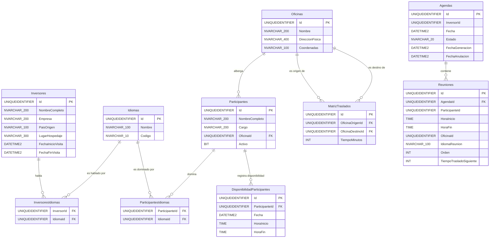

# Modelo Entidad-Relación — Sistema de Calendarización de Inversores

> **Versión sincronizada con la base de datos real `PROInversores` (Azure SQL).**
> Este documento es una copia del diseño original (`modelo_er.md`) ajustada para reflejar el estado **exacto** de las tablas implementadas en el servidor `rs-dbs-pte02-tst-4e4d-eaus-1.database.windows.net`. Para ver el diseño objetivo, consultar [`modelo_er.md`](modelo_er.md).

| | |
|---|---|
| **Proyecto** | Sistema de Calendarización de Inversores |
| **ID del proyecto** | PROCOMER-CALEND-2026 |
| **Versión** | 1.1 · Junio 2026 (sincronizado con BD) |
| **Fecha de sincronización** | 22 de junio de 2026 |
| **Motor de base de datos** | Azure SQL Database (SQL Server) |
| **Servidor** | `rs-dbs-pte02-tst-4e4d-eaus-1.database.windows.net` |
| **Base de datos** | `PROInversores` |
| **ORM** | Entity Framework Core 9 · Code First |
| **Documentos fuente** | `Prueba_Técnica.md` · `SPEC_Calendarizacion_Inversores.md` v1.0 |

---

## Tabla de Contenidos

1. [Diagrama ER](#1-diagrama-er)
2. [Descripción de Entidades](#2-descripción-de-entidades)
   - [Inversores](#inversores)
   - [Idiomas](#idiomas)
   - [InversoresIdiomas](#inversoresidiomas)
   - [Participantes](#participantes)
   - [ParticipantesIdiomas](#participantesidiomas)
   - [DisponibilidadParticipantes](#disponibilidadparticipantes)
   - [Oficinas](#oficinas)
   - [MatrizTraslados](#matriztraslados)
   - [Agendas](#agendas)
   - [Reuniones](#reuniones)
3. [Reglas de Integridad Referencial](#3-reglas-de-integridad-referencial)
4. [Índices Implementados](#4-índices-implementados)
5. [Configuración de EF Core 9 por Entidad](#5-configuración-de-ef-core-9-por-entidad)
6. [Divergencias respecto al diseño original](#6-divergencias-respecto-al-diseño-original)

---

## 1. Diagrama ER



> **Nota de partición:** Las tablas `Inversores`, `Idiomas`, `InversoresIdiomas`, `Participantes`, `ParticipantesIdiomas`, `DisponibilidadParticipantes`, `Oficinas` y `MatrizTraslados` son propiedad del **Catálogo Service** (`CatalogoDbContext`). Las tablas `Agendas` y `Reuniones` son propiedad del **Agendas Service** (`AgendasDbContext`). Ambos contextos comparten la misma Azure SQL Database pero operan sobre conjuntos de tablas disjuntos, sin relaciones de FK físicas cruzadas entre contextos.
>
> **Nota sobre relaciones ausentes en BD:** Las referencias `Agendas.InversorId → Inversores.Id`, `Reuniones.ParticipanteId → Participantes.Id`, `Reuniones.OficinaId → Oficinas.Id` y el idioma de la reunión **no tienen FK física**. La columna `Reuniones.IdiomaReunion` es `NVARCHAR(100)` denormalizada (texto plano del idioma) en lugar de FK a `Idiomas`.

---

## 2. Descripción de Entidades

### Inversores

Almacena los datos del visitante extranjero que será agendado. Es la entidad raíz del flujo de scheduling: sin un inversor con idiomas y ventana de visita válidos no puede generarse ninguna agenda.

| Campo | Tipo SQL Server | Nullable | PK/FK | Descripción | Restricciones |
|---|---|---|---|---|---|
| `Id` | `UNIQUEIDENTIFIER` | NO | PK | Identificador único del inversor. | Generado por la aplicación (EF Core / `Guid.NewGuid()`); sin `DEFAULT` en BD. |
| `NombreCompleto` | `NVARCHAR(200)` | NO | — | Nombre completo del visitante. | `NOT NULL`, máx. 200 caracteres |
| `Empresa` | `NVARCHAR(200)` | NO | — | Nombre de la empresa que representa. | `NOT NULL`, máx. 200 caracteres |
| `PaisOrigen` | `NVARCHAR(100)` | NO | — | País desde el que viaja. | `NOT NULL`, máx. 100 caracteres |
| `LugarHospedaje` | `NVARCHAR(300)` | NO | — | Lugar de hospedaje o punto de partida diario. | `NOT NULL`, máx. 300 caracteres |
| `FechaInicioVisita` | `DATETIME2` | NO | — | Primer día de la visita. | `NOT NULL`; debe ser ≤ `FechaFinVisita` (RN-02) — validado en Application Layer |
| `FechaFinVisita` | `DATETIME2` | NO | — | Último día de la visita. | `NOT NULL`; debe ser ≥ `FechaInicioVisita` (RN-02) |

> No existen columnas de auditoría (`FechaCreacion`, `FechaModificacion`) ni `RowVersion` en esta tabla.

---

### Idiomas

Catálogo cerrado de idiomas soportados por el sistema (mínimo: español, inglés). Entidad inmutable en operación normal.

| Campo | Tipo SQL Server | Nullable | PK/FK | Descripción | Restricciones |
|---|---|---|---|---|---|
| `Id` | `UNIQUEIDENTIFIER` | NO | PK | Identificador único del idioma. | Generado por la aplicación |
| `Nombre` | `NVARCHAR(100)` | NO | — | Nombre legible del idioma (ej. "Español"). | `NOT NULL`, máx. 100 caracteres |
| `Codigo` | `NVARCHAR(10)` | NO | — | Código ISO 639-1 del idioma (ej. "es", "en"). | `NOT NULL`, máx. 10 caracteres |

> Los índices únicos sobre `Codigo` y `Nombre` **no están implementados en la BD actual**; la unicidad se debe garantizar en Application Layer.

---

### InversoresIdiomas

Tabla de unión N:M entre `Inversores` e `Idiomas`. La clave primaria es compuesta (par `InversorId + IdiomaId`).

| Campo | Tipo SQL Server | Nullable | PK/FK | Descripción | Restricciones |
|---|---|---|---|---|---|
| `InversorId` | `UNIQUEIDENTIFIER` | NO | PK + FK → `Inversores.Id` | Referencia al inversor. | `NOT NULL`; `ON DELETE CASCADE` |
| `IdiomaId` | `UNIQUEIDENTIFIER` | NO | PK + FK → `Idiomas.Id` | Referencia al idioma. | `NOT NULL`; `ON DELETE NO ACTION` |

---

### Participantes

Almacena a los funcionarios o representantes institucionales que pueden ser convocados a reuniones. El estado `Activo` controla la disponibilidad para el scheduling sin perder el registro histórico.

| Campo | Tipo SQL Server | Nullable | PK/FK | Descripción | Restricciones |
|---|---|---|---|---|---|
| `Id` | `UNIQUEIDENTIFIER` | NO | PK | Identificador único del participante. | Generado por la aplicación |
| `NombreCompleto` | `NVARCHAR(200)` | NO | — | Nombre completo del participante. | `NOT NULL`, máx. 200 caracteres |
| `Cargo` | `NVARCHAR(200)` | NO | — | Cargo o institución a la que pertenece. | `NOT NULL`, máx. 200 caracteres |
| `OficinaId` | `UNIQUEIDENTIFIER` | NO | FK → `Oficinas.Id` | Oficina donde habitualmente atiende reuniones (RN-05). | `NOT NULL`; `ON DELETE NO ACTION` |
| `Activo` | `BIT` | NO | — | Indica si el participante está disponible para scheduling. | `NOT NULL`; `DEFAULT ((1))` |

> No existen columnas de auditoría (`FechaCreacion`, `FechaModificacion`) ni `RowVersion`.

---

### ParticipantesIdiomas

Tabla de unión N:M entre `Participantes` e `Idiomas`. La clave primaria es compuesta.

| Campo | Tipo SQL Server | Nullable | PK/FK | Descripción | Restricciones |
|---|---|---|---|---|---|
| `ParticipanteId` | `UNIQUEIDENTIFIER` | NO | PK + FK → `Participantes.Id` | Referencia al participante. | `NOT NULL`; `ON DELETE CASCADE` |
| `IdiomaId` | `UNIQUEIDENTIFIER` | NO | PK + FK → `Idiomas.Id` | Referencia al idioma. | `NOT NULL`; `ON DELETE NO ACTION` |

---

### DisponibilidadParticipantes

Registra los bloques horarios en los que cada participante está disponible para ser agendado en una fecha específica.

| Campo | Tipo SQL Server | Nullable | PK/FK | Descripción | Restricciones |
|---|---|---|---|---|---|
| `Id` | `UNIQUEIDENTIFIER` | NO | PK | Identificador único del bloque. | Generado por la aplicación |
| `ParticipanteId` | `UNIQUEIDENTIFIER` | NO | FK → `Participantes.Id` | Referencia al participante dueño del bloque. | `NOT NULL`; `ON DELETE CASCADE` |
| `Fecha` | `DATETIME2` | NO | — | Fecha a la que aplica el bloque (se usa la parte de fecha). | `NOT NULL` |
| `HoraInicio` | `TIME` | NO | — | Hora de inicio del bloque disponible. | `NOT NULL`; debe ser ≥ 08:00 (RN-09) |
| `HoraFin` | `TIME` | NO | — | Hora de fin del bloque disponible. | `NOT NULL`; ≤ 17:00 (RN-10); no puede solaparse con 12:00-13:00 (RN-11) |

---

### Oficinas

Almacena las ubicaciones físicas donde se realizan las reuniones.

| Campo | Tipo SQL Server | Nullable | PK/FK | Descripción | Restricciones |
|---|---|---|---|---|---|
| `Id` | `UNIQUEIDENTIFIER` | NO | PK | Identificador único de la oficina. | Generado por la aplicación |
| `Nombre` | `NVARCHAR(200)` | NO | — | Nombre identificable de la oficina. | `NOT NULL`, máx. 200 caracteres |
| `DireccionFisica` | `NVARCHAR(400)` | NO | — | Dirección física completa. | `NOT NULL`, máx. 400 caracteres |
| `Coordenadas` | `NVARCHAR(100)` | SÍ | — | Coordenadas geográficas en formato texto (ej. `"9.928069, -84.090725"`). | Opcional; sin restricción de formato a nivel BD |

> Las coordenadas se almacenan como una **única cadena de texto**, no como dos columnas `DECIMAL`. El parseo a `(Latitud, Longitud)` se realiza en la capa de aplicación cuando se requiera.

---

### MatrizTraslados

Almacena los tiempos de desplazamiento en minutos entre pares de oficinas. La simetría del par (RN-07) se gestiona en Application Layer, no por restricción de BD.

| Campo | Tipo SQL Server | Nullable | PK/FK | Descripción | Restricciones |
|---|---|---|---|---|---|
| `Id` | `UNIQUEIDENTIFIER` | NO | PK | Identificador único del par. | Generado por la aplicación |
| `OficinaOrigenId` | `UNIQUEIDENTIFIER` | NO | FK → `Oficinas.Id` | Oficina de partida del traslado. | `NOT NULL`; `ON DELETE NO ACTION` |
| `OficinaDestinoId` | `UNIQUEIDENTIFIER` | NO | FK → `Oficinas.Id` | Oficina de llegada del traslado. | `NOT NULL`; `ON DELETE NO ACTION` |
| `TiempoMinutos` | `INT` | NO | — | Tiempo estimado de traslado en minutos. | `NOT NULL`; valor ≥ 0 |

> Existe el índice único compuesto `UQ_MatrizTraslados_Par` sobre `(OficinaOrigenId, OficinaDestinoId)` que garantiza la unicidad del par. No existen columnas de auditoría.

---

### Agendas

Representa el itinerario diario generado para un inversor. El campo `Estado` controla el ciclo de vida (`Activa` / `Anulada`). La anulación es lógica (soft delete · RN-15).

| Campo | Tipo SQL Server | Nullable | PK/FK | Descripción | Restricciones |
|---|---|---|---|---|---|
| `Id` | `UNIQUEIDENTIFIER` | NO | PK | Identificador único de la agenda. | Generado por la aplicación |
| `InversorId` | `UNIQUEIDENTIFIER` | NO | FK (lógica) | Referencia al inversor; **sin FK física** en BD. | `NOT NULL`; validado en Application Layer |
| `Fecha` | `DATETIME2` | NO | — | Fecha de la jornada agendada. | `NOT NULL`; debe estar en rango de visita del inversor (RN-08) |
| `Estado` | `NVARCHAR(20)` | NO | — | Estado de ciclo de vida. | `NOT NULL`; `DEFAULT (N'Activa')`; valores: `'Activa'`, `'Anulada'` |
| `FechaGeneracion` | `DATETIME2` | NO | — | Timestamp en que se generó la agenda. | `NOT NULL`; asignado por la aplicación al insertar |
| `FechaAnulacion` | `DATETIME2` | SÍ | — | Timestamp de la anulación lógica; `NULL` mientras está activa. | Nulo si `Estado = 'Activa'` |

> No existe `RowVersion` en la BD; la concurrencia optimista, si se requiere, debe gestionarse por otros medios (timestamp manual o token aplicativo).

---

### Reuniones

Almacena cada elemento del itinerario dentro de una agenda. Esta entidad nunca se modifica una vez persistida (la agenda se anula y regenera completa si hay cambios).

| Campo | Tipo SQL Server | Nullable | PK/FK | Descripción | Restricciones |
|---|---|---|---|---|---|
| `Id` | `UNIQUEIDENTIFIER` | NO | PK | Identificador único de la reunión. | Generado por la aplicación |
| `AgendaId` | `UNIQUEIDENTIFIER` | NO | FK → `Agendas.Id` | Agenda a la que pertenece esta reunión. | `NOT NULL`; `ON DELETE CASCADE` |
| `ParticipanteId` | `UNIQUEIDENTIFIER` | NO | FK (lógica) | Referencia al participante; **sin FK física**. | `NOT NULL`; validado en Application Layer |
| `HoraInicio` | `TIME` | NO | — | Hora de inicio de la reunión. | `NOT NULL`; ≥ 08:00 (RN-09); no en 12:00-13:00 (RN-11) |
| `HoraFin` | `TIME` | NO | — | Hora de fin de la reunión. | `NOT NULL`; ≤ 17:00 (RN-10) |
| `OficinaId` | `UNIQUEIDENTIFIER` | NO | FK (lógica) | Referencia a la oficina sede; **sin FK física**. | `NOT NULL`; validado en Application Layer |
| `IdiomaReunion` | `NVARCHAR(100)` | NO | — | Nombre del idioma en que se realizará la reunión (denormalizado, no FK). | `NOT NULL`; debe coincidir con un idioma compartido inversor-participante (RN-12) |
| `Orden` | `INT` | NO | — | Número de orden de la reunión dentro del día (1-based). | `NOT NULL`; ≥ 1 |
| `TiempoTrasladoSiguiente` | `INT` | NO | — | Minutos de traslado a la siguiente reunión. | `NOT NULL`; `DEFAULT ((0))`; `0` en la última reunión del día |

> Cambios respecto al diseño original: `IdiomaReunionId` (FK) → **`IdiomaReunion`** (texto plano); `TiempoTrasladoSiguienteMinutos` (nullable) → **`TiempoTrasladoSiguiente`** (NOT NULL con default 0).

---

## 3. Reglas de Integridad Referencial

Foreign keys efectivamente creadas en la BD (9 en total):

| FK | Tabla origen → Tabla destino | ON DELETE | ON UPDATE |
|---|---|---|---|
| `FK_InversoresIdiomas_Inversores` | `InversoresIdiomas.InversorId` → `Inversores.Id` | **CASCADE** | NO ACTION |
| `FK_InversoresIdiomas_Idiomas` | `InversoresIdiomas.IdiomaId` → `Idiomas.Id` | NO ACTION | NO ACTION |
| `FK_Participantes_Oficinas` | `Participantes.OficinaId` → `Oficinas.Id` | NO ACTION | NO ACTION |
| `FK_ParticipantesIdiomas_Participantes` | `ParticipantesIdiomas.ParticipanteId` → `Participantes.Id` | **CASCADE** | NO ACTION |
| `FK_ParticipantesIdiomas_Idiomas` | `ParticipantesIdiomas.IdiomaId` → `Idiomas.Id` | NO ACTION | NO ACTION |
| `FK_DisponibilidadParticipantes_Participantes` | `DisponibilidadParticipantes.ParticipanteId` → `Participantes.Id` | **CASCADE** | NO ACTION |
| `FK_MatrizTraslados_OficinaOrigen` | `MatrizTraslados.OficinaOrigenId` → `Oficinas.Id` | NO ACTION | NO ACTION |
| `FK_MatrizTraslados_OficinaDestino` | `MatrizTraslados.OficinaDestinoId` → `Oficinas.Id` | NO ACTION | NO ACTION |
| `FK_Reuniones_Agendas` | `Reuniones.AgendaId` → `Agendas.Id` | **CASCADE** | NO ACTION |

**Referencias lógicas sin FK física en BD** (gestionadas exclusivamente en Application Layer):

| Columna | Apunta lógicamente a | Comentario |
|---|---|---|
| `Agendas.InversorId` | `Inversores.Id` | Partición de contextos (`AgendasDbContext` vs `CatalogoDbContext`). La protección de RN-03 (no eliminar inversor con agendas activas) se hace en `EliminarInversorHandler`. |
| `Reuniones.ParticipanteId` | `Participantes.Id` | Ídem cross-context. |
| `Reuniones.OficinaId` | `Oficinas.Id` | Ídem cross-context. |
| `Reuniones.IdiomaReunion` *(texto)* | `Idiomas.Nombre` | Denormalizado a `NVARCHAR(100)`; el contenido debe coincidir con un valor existente de `Idiomas.Nombre` (no garantizado por BD). |

---

## 4. Índices Implementados

Además de las claves primarias (PK clustered en `Id` de cada tabla y PK compuesta en `InversoresIdiomas` / `ParticipantesIdiomas`), la BD tiene los siguientes índices no clustered:

| Tabla | Índice | Únique | Columnas clave | Columnas INCLUDE |
|---|---|---|---|---|
| `Agendas` | `IX_Agendas_Fecha` | No | `Fecha` | `InversorId`, `Estado`, `FechaGeneracion` |
| `Agendas` | `IX_Agendas_FechaGeneracion` | No | `FechaGeneracion` | `InversorId`, `Fecha`, `Estado` |
| `Agendas` | `IX_Agendas_InversorId` | No | `InversorId` | `Fecha`, `Estado`, `FechaGeneracion`, `FechaAnulacion` |
| `DisponibilidadParticipantes` | `IX_DisponibilidadParticipantes_ParticipanteId_Fecha` | No | `ParticipanteId`, `Fecha` | `HoraInicio`, `HoraFin` |
| `InversoresIdiomas` | `IX_InversoresIdiomas_IdiomaId` | No | `IdiomaId` | — |
| `MatrizTraslados` | `UQ_MatrizTraslados_Par` | **Sí** | `OficinaOrigenId`, `OficinaDestinoId` | — |
| `Participantes` | `IX_Participantes_OficinaId_Activo` | No | `OficinaId`, `Activo` | — |
| `Participantes` | `IX_Participantes_Activo` | No | `Activo` | `NombreCompleto`, `Cargo`, `OficinaId` |
| `ParticipantesIdiomas` | `IX_ParticipantesIdiomas_IdiomaId` | No | `IdiomaId` | — |
| `Reuniones` | `IX_Reuniones_AgendaId` | No | `AgendaId`, `Orden` | `ParticipanteId`, `HoraInicio`, `HoraFin`, `OficinaId`, `IdiomaReunion`, `TiempoTrasladoSiguiente` |

---

## 5. Configuración de EF Core 9 por Entidad

> Pseudocódigo Fluent API alineado a las columnas reales de la BD. **No incluye** propiedades de auditoría (`FechaCreacion`, `FechaModificacion`) ni `RowVersion`, ya que no existen en las tablas implementadas.

### Inversores — `InversorConfiguration`

```
HasKey(x => x.Id)

Property(x => x.Id)
    .IsRequired()

Property(x => x.NombreCompleto)
    .IsRequired()
    .HasMaxLength(200)

Property(x => x.Empresa)
    .IsRequired()
    .HasMaxLength(200)

Property(x => x.PaisOrigen)
    .IsRequired()
    .HasMaxLength(100)

Property(x => x.LugarHospedaje)
    .IsRequired()
    .HasMaxLength(300)

Property(x => x.FechaInicioVisita)
    .IsRequired()
    .HasColumnType("datetime2")

Property(x => x.FechaFinVisita)
    .IsRequired()
    .HasColumnType("datetime2")

HasMany(x => x.Idiomas)
    .WithMany(x => x.Inversores)
    .UsingEntity<InversorIdioma>(
        j => j.HasOne(ii => ii.Idioma).WithMany().HasForeignKey(ii => ii.IdiomaId)
                .OnDelete(DeleteBehavior.NoAction),
        j => j.HasOne(ii => ii.Inversor).WithMany().HasForeignKey(ii => ii.InversorId)
                .OnDelete(DeleteBehavior.Cascade)
    )
```

---

### Idiomas — `IdiomaConfiguration`

```
HasKey(x => x.Id)

Property(x => x.Id)
    .IsRequired()

Property(x => x.Nombre)
    .IsRequired()
    .HasMaxLength(100)

Property(x => x.Codigo)
    .IsRequired()
    .HasMaxLength(10)
```

---

### InversoresIdiomas — `InversorIdiomaConfiguration`

```
HasKey(x => new { x.InversorId, x.IdiomaId })

Property(x => x.InversorId)
    .IsRequired()

Property(x => x.IdiomaId)
    .IsRequired()

HasIndex(x => x.IdiomaId)
    .HasDatabaseName("IX_InversoresIdiomas_IdiomaId")
```

---

### Participantes — `ParticipanteConfiguration`

```
HasKey(x => x.Id)

Property(x => x.Id)
    .IsRequired()

Property(x => x.NombreCompleto)
    .IsRequired()
    .HasMaxLength(200)

Property(x => x.Cargo)
    .IsRequired()
    .HasMaxLength(200)

Property(x => x.OficinaId)
    .IsRequired()

Property(x => x.Activo)
    .IsRequired()
    .HasDefaultValue(true)

HasOne(x => x.Oficina)
    .WithMany(o => o.Participantes)
    .HasForeignKey(x => x.OficinaId)
    .OnDelete(DeleteBehavior.NoAction)

HasMany(x => x.Idiomas)
    .WithMany(x => x.Participantes)
    .UsingEntity<ParticipanteIdioma>(
        j => j.HasOne(pi => pi.Idioma).WithMany().HasForeignKey(pi => pi.IdiomaId)
                .OnDelete(DeleteBehavior.NoAction),
        j => j.HasOne(pi => pi.Participante).WithMany().HasForeignKey(pi => pi.ParticipanteId)
                .OnDelete(DeleteBehavior.Cascade)
    )

HasMany(x => x.Disponibilidades)
    .WithOne(d => d.Participante)
    .HasForeignKey(d => d.ParticipanteId)
    .OnDelete(DeleteBehavior.Cascade)

HasIndex(x => new { x.OficinaId, x.Activo })
    .HasDatabaseName("IX_Participantes_OficinaId_Activo")

HasIndex(x => x.Activo)
    .HasDatabaseName("IX_Participantes_Activo")
```

---

### ParticipantesIdiomas — `ParticipanteIdiomaConfiguration`

```
HasKey(x => new { x.ParticipanteId, x.IdiomaId })

Property(x => x.ParticipanteId)
    .IsRequired()

Property(x => x.IdiomaId)
    .IsRequired()

HasIndex(x => x.IdiomaId)
    .HasDatabaseName("IX_ParticipantesIdiomas_IdiomaId")
```

---

### DisponibilidadParticipantes — `DisponibilidadParticipanteConfiguration`

```
HasKey(x => x.Id)

Property(x => x.Id)
    .IsRequired()

Property(x => x.ParticipanteId)
    .IsRequired()

Property(x => x.Fecha)
    .IsRequired()
    .HasColumnType("datetime2")

Property(x => x.HoraInicio)
    .IsRequired()
    .HasColumnType("time")

Property(x => x.HoraFin)
    .IsRequired()
    .HasColumnType("time")

HasOne(x => x.Participante)
    .WithMany(p => p.Disponibilidades)
    .HasForeignKey(x => x.ParticipanteId)
    .OnDelete(DeleteBehavior.Cascade)

HasIndex(x => new { x.ParticipanteId, x.Fecha })
    .HasDatabaseName("IX_DisponibilidadParticipantes_ParticipanteId_Fecha")
```

---

### Oficinas — `OficinaConfiguration`

```
HasKey(x => x.Id)

Property(x => x.Id)
    .IsRequired()

Property(x => x.Nombre)
    .IsRequired()
    .HasMaxLength(200)

Property(x => x.DireccionFisica)
    .IsRequired()
    .HasMaxLength(400)

Property(x => x.Coordenadas)
    .HasMaxLength(100)
    // IsRequired(false) — columna nullable; texto libre "lat, lng"

HasMany(x => x.TrasladosComoOrigen)
    .WithOne(t => t.OficinaOrigen)
    .HasForeignKey(t => t.OficinaOrigenId)
    .OnDelete(DeleteBehavior.NoAction)

HasMany(x => x.TrasladosComoDestino)
    .WithOne(t => t.OficinaDestino)
    .HasForeignKey(t => t.OficinaDestinoId)
    .OnDelete(DeleteBehavior.NoAction)
```

---

### MatrizTraslados — `MatrizTrasladoConfiguration`

```
HasKey(x => x.Id)

Property(x => x.Id)
    .IsRequired()

Property(x => x.OficinaOrigenId)
    .IsRequired()

Property(x => x.OficinaDestinoId)
    .IsRequired()

Property(x => x.TiempoMinutos)
    .IsRequired()

HasOne(x => x.OficinaOrigen)
    .WithMany(o => o.TrasladosComoOrigen)
    .HasForeignKey(x => x.OficinaOrigenId)
    .OnDelete(DeleteBehavior.NoAction)

HasOne(x => x.OficinaDestino)
    .WithMany(o => o.TrasladosComoDestino)
    .HasForeignKey(x => x.OficinaDestinoId)
    .OnDelete(DeleteBehavior.NoAction)

HasIndex(x => new { x.OficinaOrigenId, x.OficinaDestinoId })
    .IsUnique()
    .HasDatabaseName("UQ_MatrizTraslados_Par")
```

---

### Agendas — `AgendaConfiguration`

```
HasKey(x => x.Id)

Property(x => x.Id)
    .IsRequired()

Property(x => x.InversorId)
    .IsRequired()
    // Sin HasOne / WithMany: FK lógica cross-context

Property(x => x.Fecha)
    .IsRequired()
    .HasColumnType("datetime2")

Property(x => x.Estado)
    .IsRequired()
    .HasMaxLength(20)
    .HasDefaultValue("Activa")
    // Valores permitidos: 'Activa', 'Anulada' — validados en dominio

Property(x => x.FechaGeneracion)
    .IsRequired()
    .HasColumnType("datetime2")

Property(x => x.FechaAnulacion)
    .HasColumnType("datetime2")
    // IsRequired(false) — nullable mientras Estado = 'Activa'

HasMany(x => x.Reuniones)
    .WithOne(r => r.Agenda)
    .HasForeignKey(r => r.AgendaId)
    .OnDelete(DeleteBehavior.Cascade)

HasIndex(x => x.InversorId)
    .HasDatabaseName("IX_Agendas_InversorId")

HasIndex(x => x.Fecha)
    .HasDatabaseName("IX_Agendas_Fecha")

HasIndex(x => x.FechaGeneracion)
    .HasDatabaseName("IX_Agendas_FechaGeneracion")
```

---

### Reuniones — `ReunionConfiguration`

```
HasKey(x => x.Id)

Property(x => x.Id)
    .IsRequired()

Property(x => x.AgendaId)
    .IsRequired()

Property(x => x.ParticipanteId)
    .IsRequired()
    // Sin HasOne: FK lógica cross-context

Property(x => x.HoraInicio)
    .IsRequired()
    .HasColumnType("time")

Property(x => x.HoraFin)
    .IsRequired()
    .HasColumnType("time")

Property(x => x.OficinaId)
    .IsRequired()
    // Sin HasOne: FK lógica cross-context

Property(x => x.IdiomaReunion)
    .IsRequired()
    .HasMaxLength(100)
    // Texto denormalizado del nombre del idioma; no es FK

Property(x => x.Orden)
    .IsRequired()

Property(x => x.TiempoTrasladoSiguiente)
    .IsRequired()
    .HasDefaultValue(0)
    // NOT NULL en BD; 0 = última reunión del día

HasOne(x => x.Agenda)
    .WithMany(a => a.Reuniones)
    .HasForeignKey(x => x.AgendaId)
    .OnDelete(DeleteBehavior.Cascade)

HasIndex(x => new { x.AgendaId, x.Orden })
    .HasDatabaseName("IX_Reuniones_AgendaId")
```

---

## 6. Divergencias respecto al diseño original

Resumen de las diferencias entre [`modelo_er.md`](modelo_er.md) (diseño objetivo) y la implementación actual descrita en este documento:

| # | Tabla | Diseño original | BD real |
|---|---|---|---|
| 1 | `Inversores` | `FechaInicioVisita`, `FechaFinVisita` como `DATE` | `DATETIME2` |
| 2 | `Inversores` | Incluye `FechaCreacion`, `FechaModificacion`, `RowVersion` | No existen |
| 3 | `Participantes` | Columna `CargoInstitucion` | Renombrada a **`Cargo`** |
| 4 | `Participantes` | Incluye `FechaCreacion`, `FechaModificacion`, `RowVersion` | No existen |
| 5 | `DisponibilidadParticipantes` | `Fecha` como `DATE` | `DATETIME2` |
| 6 | `Oficinas` | `Direccion NVARCHAR(400)` + `Latitud DECIMAL(9,6)` + `Longitud DECIMAL(9,6)` | **`DireccionFisica`** + **`Coordenadas NVARCHAR(100)`** (una sola columna texto) |
| 7 | `Oficinas` | Incluye `FechaCreacion` | No existe |
| 8 | `MatrizTraslados` | Incluye `FechaCreacion`, `FechaModificacion` | No existen |
| 9 | `MatrizTraslados` | FKs con `ON DELETE CASCADE` | `ON DELETE NO ACTION` |
| 10 | `Agendas` | `Fecha` como `DATE` | `DATETIME2` |
| 11 | `Agendas` | Incluye `RowVersion` | No existe |
| 12 | `Agendas` | Estado sin default declarado | `DEFAULT (N'Activa')` |
| 13 | `Reuniones` | `IdiomaReunionId UNIQUEIDENTIFIER` (FK lógica a Idiomas) | **`IdiomaReunion NVARCHAR(100)`** (texto plano denormalizado) |
| 14 | `Reuniones` | `TiempoTrasladoSiguienteMinutos INT` nullable | **`TiempoTrasladoSiguiente INT`** NOT NULL `DEFAULT ((0))` |
| 15 | Relaciones | Mermaid declara `Idiomas ||--o{ Reuniones` | **Eliminada** (no existe FK porque la columna es texto) |
| 16 | FKs idioma/oficina | Originales con `RESTRICT` | Todas como `NO ACTION` |
| 17 | `Idiomas` | Índices únicos en `Codigo` y `Nombre` | No implementados |

---

*Documento sincronizado con la BD real `PROInversores` el 22 de junio de 2026. Para el diseño objetivo, ver [`modelo_er.md`](modelo_er.md).*
