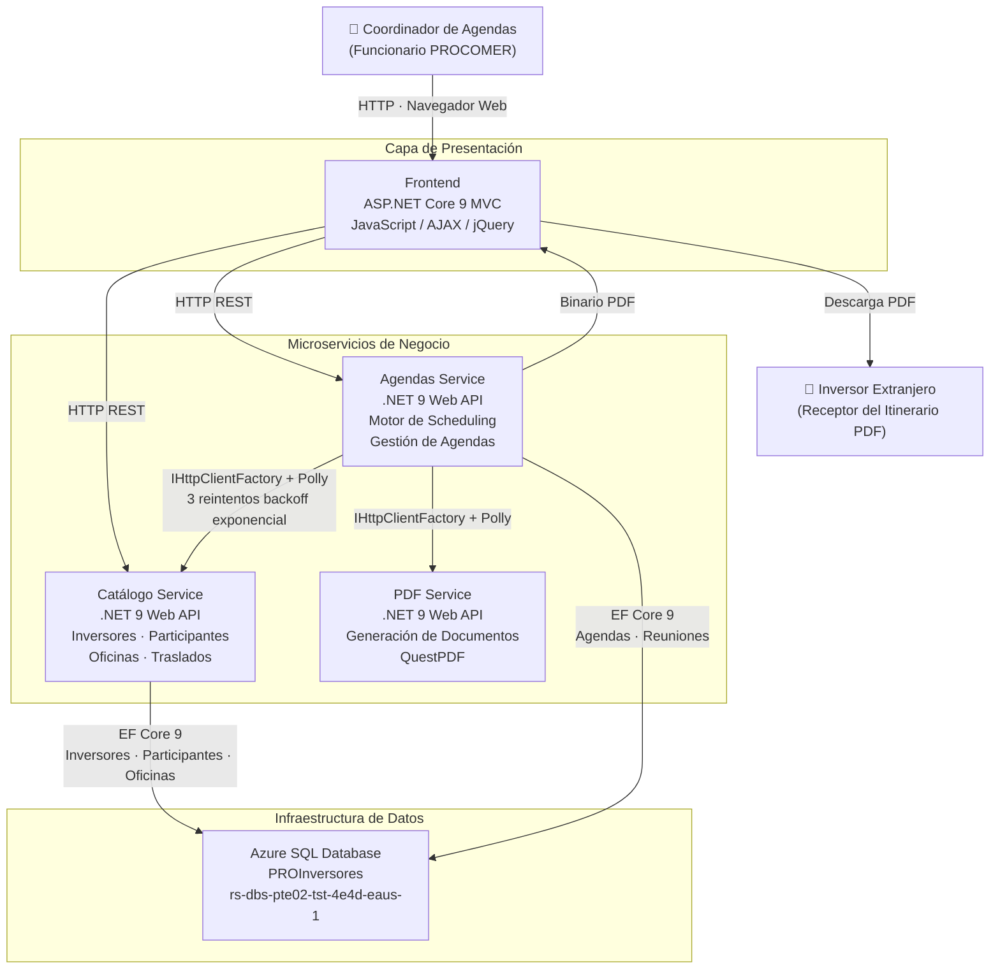
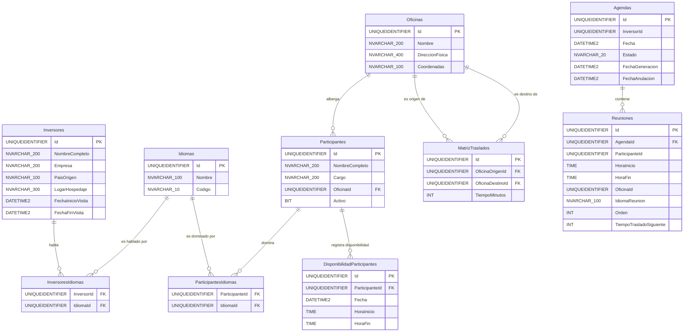
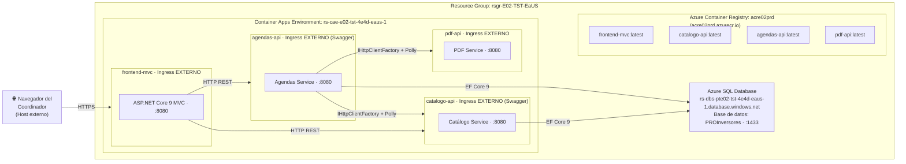

# Sistema de Calendarización de Inversores — PROCOMER

**Contratación:** 2026XE-000001-0001700001  
**Stack:** .NET 9 · ASP.NET Core 9 · Entity Framework Core 9 · Azure Container Apps · Azure SQL Database · QuestPDF  

---

## Descripción general

PROCOMER recibe periódicamente visitas de inversores extranjeros que requieren reunirse con representantes de instituciones y empresas costarricenses. La coordinación manual de estas agendas es propensa a errores: solapamientos de horario, incumplimiento de tiempos de traslado, incompatibilidades de idioma y agotamiento de la ventana de visita del inversor.

Este sistema automatiza la **generación del itinerario diario** del inversor aplicando un algoritmo de scheduling que respeta 15 reglas de negocio:

- Ventana de visita del inversor (fechas y horas 08:00–17:00).
- Compatibilidad de idioma entre inversor y participante.
- Disponibilidad horaria de cada participante por fecha.
- Tiempos de traslado entre oficinas (matriz simétrica).
- Bloqueo del almuerzo 12:00–13:00.
- Sin solapamiento de participantes en el mismo horario.

El resultado es una **agenda PDF en español (es-CR)** descargable con el itinerario completo de reuniones, traslados y participantes, con trazabilidad de anulaciones lógicas.

---

## Documentación

| Artefacto | Enlace |
|---|---|
| Casos de uso (CU-01 a CU-06) | [Docs/casos_de_uso.md](Docs/casos_de_uso.md) |
| Arquitectura del sistema | [Docs/arquitectura.md](Docs/arquitectura.md) |
| Modelo entidad-relación (BD real) | [Docs/modelo_er_actual.md](Docs/modelo_er_actual.md) |
| Documentación del prototipo HTML | [Docs/Prototipo/DocumentacionPrototipo.md](Docs/Prototipo/DocumentacionPrototipo.md) |
| Script de despliegue Azure | [Code/deployment.ps1](Code/deployment.ps1) |

---

## Diagrama de arquitectura



---

## Diagrama entidad-relación (BD implementada)



> Modelo sincronizado con la BD real `PROInversores`. Detalle completo en [Docs/modelo_er_actual.md](Docs/modelo_er_actual.md).

---

## Diagrama de despliegue — Azure Container Apps



---

## Estructura de la solución

```
Code/
├── PROCalendarizacionInversores.sln
│
├── Catalogo/                          # Microservicio de catálogo (CU-01, CU-02, CU-03)
│   ├── Catalogo.Domain/               # Entidades: Inversor, Participante, Oficina, Idioma, MatrizTraslado
│   ├── Catalogo.Application/          # Handlers, interfaces de repositorio, DTOs, excepciones de dominio
│   ├── Catalogo.Infrastructure/       # CatalogoDbContext, repositorios EF Core, configuraciones Fluent API
│   └── Catalogo.API/                  # Controllers (Inversores, Participantes, Oficinas, Traslados, Idiomas)
│       └── Dockerfile
│
├── Agendas/                           # Microservicio de agendas (CU-04, CU-05, CU-06)
│   ├── Agendas.Domain/                # Entidades: Agenda, Reunion; enums: AgendaEstado, SchedulingErrorCode
│   ├── Agendas.Application/           # SchedulingEngine (Greedy), handlers, HTTP clients tipados, excepciones
│   ├── Agendas.Infrastructure/        # AgendasDbContext, AgendaRepository, CatalogoHttpClient, PdfServiceHttpClient
│   └── Agendas.API/                   # AgendasController
│       └── Dockerfile
│
├── PDF/                               # Microservicio de generación de PDF
│   ├── PDF.Domain/                    # Modelo del documento: AgendaDocument, PdfConfig
│   ├── PDF.Application/               # GenerarPdfHandler, interfaz IPdfGeneratorService
│   ├── PDF.Infrastructure/            # QuestPdfGeneratorService (idioma es-CR, formato A4)
│   └── PDF.API/                       # GenerarPdfController
│       └── Dockerfile
│
├── Frontend/                          # Aplicación web MVC (ASP.NET Core 9)
│   └── Frontend.MVC/                  # Controllers, Views (Razor), wwwroot (Bootstrap 5, jQuery, AJAX)
│       └── Dockerfile
│
├── tests/
│   └── Agendas.UnitTests/             # 10 pruebas xUnit: SchedulingEngine, TravelTimeResolver, AnularAgenda
│
└── deployment.ps1                     # Script de despliegue en Azure Container Apps
```

---

## Despliegue en Azure

El script [Code/deployment.ps1](Code/deployment.ps1) automatiza el despliegue completo de los 4 contenedores sobre la infraestructura Azure provisionada por PROCOMER.

**Ejecutar desde la carpeta `Code/`:**

```powershell
cd Code
.\deployment.ps1
```

**Secuencia del script:**

1. Verifica que existan el Resource Group, el ACR y el Container Apps Environment.
2. Construye las 4 imágenes Docker en ACR con `az acr build` (sin Docker local).
3. Despliega en orden de dependencia: `catalogo-api` → `pdf-api` → `agendas-api` → `frontend-mvc`.
4. Captura los FQDNs públicos e inyecta las URLs de servicio como variables de entorno.
5. Configura CORS en `catalogo-api` y `agendas-api` con el FQDN real del frontend.

**Infraestructura Azure utilizada:**

| Recurso | Nombre |
|---|---|
| Resource Group | `rsgr-E02-TST-EaUS` |
| Container Registry | `acre02prd` |
| Container Apps Environment | `rs-cae-e02-tst-4e4d-eaus-1` |
| SQL Server | `rs-dbs-pte02-tst-4e4d-eaus-1.database.windows.net` |
| Base de datos | `PROInversores` |

---

## Pruebas unitarias

```powershell
cd Code
dotnet test tests/Agendas.UnitTests/Agendas.UnitTests.csproj
```

10 pruebas — cobertura sobre `SchedulingEngine`, `TravelTimeResolver`, `LanguageCompatibilityFilter` y anulación lógica de agendas.

---

*PROCOMER-CALEND-2026 · Junio 2026*